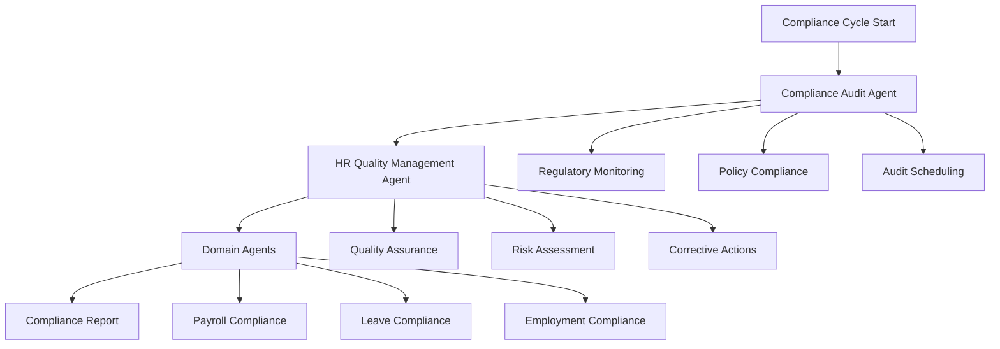

# Compliance Monitoring Workflow — Continuous Regulatory Oversight

## Overview

This workflow implements continuous compliance monitoring by orchestrating multiple AI agents to ensure ongoing regulatory compliance across all HR functions. The workflow coordinates the Compliance Audit Agent, HR Quality Management Agent, and domain-specific agents to monitor, audit, and report on compliance status.

## Workflow Architecture



## Participating Agents

### 1. Compliance Audit Agent
**Role**: Core compliance monitoring and auditing
**Responsibilities**:
- Monitor regulatory changes
- Schedule and conduct audits
- Verify compliance status
- Generate compliance reports

### 2. HR Quality Management Agent
**Role**: Process quality and risk management
**Responsibilities**:
- Assess compliance risks
- Monitor process effectiveness
- Implement corrective actions
- Track compliance metrics

### 3. Domain-Specific Agents
**Role**: Specialized compliance monitoring
**Responsibilities**:
- Monitor domain-specific regulations
- Conduct specialized audits
- Provide compliance guidance
- Report domain-specific issues

## Workflow Stages

### Stage 1: Regulatory Monitoring

**Trigger**: Scheduled monitoring cycle (daily/weekly/monthly)
**Coordinator**: Compliance Audit Agent

```yaml
actions:
  - agent: compliance-audit
    action: monitor_regulatory_changes
    inputs:
      - regulatory_sources
      - subscription_alerts
      - change_detection_rules
    outputs:
      - regulatory_updates
      - impact_assessment
      - compliance_adjustments
  
  - agent: compliance-audit
    action: update_compliance_library
    inputs:
      - new_regulations
      - policy_changes
      - compliance_requirements
    outputs:
      - updated_policies
      - training_requirements
      - system_updates
```

### Stage 2: Compliance Auditing

**Trigger**: Audit schedule or risk trigger
**Coordinator**: HR Quality Management Agent

```yaml
actions:
  - agent: hr-quality-management
    action: schedule_audits
    inputs:
      - risk_assessment
      - audit_frequency
      - resource_availability
    outputs:
      - audit_schedule
      - audit_scope
      - resource_allocation
  
  - agent: compliance-audit
    action: conduct_compliance_audit
    inputs:
      - audit_checklist
      - system_data
      - documentation_review
    outputs:
      - audit_findings
      - compliance_status
      - non_compliance_items
  
  - agent: hr-quality-management
    action: assess_risks
    inputs:
      - audit_findings
      - risk_matrix
      - historical_data
    outputs:
      - risk_ratings
      - priority_actions
      - mitigation_plans
```

### Stage 3: Corrective Actions & Reporting

**Trigger**: Audit findings or compliance issues
**Coordinator**: Compliance Audit Agent

```yaml
actions:
  - agent: compliance-audit
    action: develop_corrective_actions
    inputs:
      - non_compliance_findings
      - risk_assessment
      - regulatory_requirements
    outputs:
      - action_plans
      - timelines
      - responsible_parties
  
  - agent: hr-quality-management
    action: implement_corrective_actions
    inputs:
      - action_plans
      - implementation_resources
      - monitoring_requirements
    outputs:
      - implementation_status
      - effectiveness_measures
      - follow_up_schedule
  
  - agent: compliance-audit
    action: generate_compliance_reports
    inputs:
      - audit_results
      - corrective_actions
      - compliance_metrics
    outputs:
      - compliance_dashboard
      - regulatory_reports
      - management_summaries
```

## Compliance Domains

### Employment Law Compliance

```yaml
employment_compliance:
  employment_act_1955:
    - Minimum wage compliance
    - Working hours regulations
    - Annual leave entitlements
    - Termination procedures
    - Maternity leave requirements
  
  industrial_relations_act_1967:
    - Trade union recognition
    - Collective bargaining
    - Industrial action procedures
    - Dispute resolution
  
  monitoring_frequency: "Monthly"
  audit_scope: "All employment records"
```

### Payroll & Taxation Compliance

```yaml
payroll_compliance:
  epf_act_1991:
    - Contribution calculations
    - Filing deadlines
    - Employee records
    - Employer obligations
  
  socso_act_1969:
    - Contribution rates
    - Coverage requirements
    - Claim procedures
    - Reporting obligations
  
  income_tax_act_1967:
    - Tax deduction compliance
    - Filing requirements
    - Record keeping
    - Penalty avoidance
  
  monitoring_frequency: "Monthly"
  audit_scope: "Payroll records and filings"
```

### Data Protection Compliance

```yaml
pdpa_compliance:
  personal_data_protection:
    - Consent management
    - Data collection limitations
    - Storage and security
    - Data subject rights
  
  monitoring_frequency: "Quarterly"
  audit_scope: "Data handling processes"
```

## Risk Assessment Framework

### Risk Categories

```yaml
risk_categories:
  critical:
    - "Regulatory non-compliance"
    - "Data breaches"
    - "Employment law violations"
    impact: "High"
    probability: "Low"
  
  high:
    - "Filing delays"
    - "Inaccurate records"
    - "Process failures"
    impact: "Medium-High"
    probability: "Medium"
  
  medium:
    - "Minor documentation issues"
    - "Process inefficiencies"
    impact: "Low-Medium"
    probability: "High"
  
  low:
    - "Administrative errors"
    - "Minor policy deviations"
    impact: "Low"
    probability: "High"
```

### Risk Scoring Matrix

```yaml
risk_scoring:
  impact_levels:
    1: "Minimal impact on operations"
    2: "Limited impact, correctable"
    3: "Moderate impact on processes"
    4: "Significant operational impact"
    5: "Critical business disruption"
  
  probability_levels:
    1: "Very unlikely (<5%)"
    2: "Unlikely (5-25%)"
    3: "Possible (25-50%)"
    4: "Likely (50-75%)"
    5: "Very likely (>75%)"
  
  risk_score: "Impact × Probability"
  action_thresholds:
    critical: ">15"
    high: "8-15"
    medium: "4-7"
    low: "<4"
```

## Quality Gates

### Gate 1: Regulatory Monitoring
**Criteria**: All regulatory changes identified and assessed
**Responsible Agent**: Compliance Audit Agent
**Success Metric**: 100% change detection rate

### Gate 2: Audit Completion
**Criteria**: All scheduled audits completed on time
**Responsible Agent**: HR Quality Management Agent
**Success Metric**: 95% on-time completion rate

### Gate 3: Issue Resolution
**Criteria**: All critical compliance issues resolved
**Responsible Agent**: Compliance Audit Agent
**Success Metric**: Zero outstanding critical issues

### Gate 4: Reporting Accuracy
**Criteria**: Compliance reports accurate and complete
**Responsible Agent**: HR Quality Management Agent
**Success Metric**: 100% report accuracy rate

## Integration Points

### HRMS Integration
```typescript
interface ComplianceWorkflow {
  // Monitoring management
  startComplianceCycle(cycleConfig: ComplianceCycle): Promise<CycleInstance>
  monitorCompliance(domain: ComplianceDomain): Promise<MonitoringResult>
  detectRegulatoryChanges(): Promise<ChangeDetectionResult>
  
  // Audit management
  scheduleAudit(auditConfig: AuditConfig): Promise<AuditSchedule>
  conductAudit(auditId: string): Promise<AuditResult>
  generateAuditReport(auditId: string): Promise<AuditReport>
  
  // Risk management
  assessRisks(domain: ComplianceDomain): Promise<RiskAssessment>
  createCorrectiveAction(issueId: string, actionPlan: ActionPlan): Promise<CorrectiveAction>
  trackActionProgress(actionId: string): Promise<ProgressResult>
  
  // Reporting
  generateComplianceDashboard(): Promise<ComplianceDashboard>
  createRegulatoryReport(reportType: ReportType): Promise<RegulatoryReport>
  exportComplianceData(filters: ExportFilters): Promise<ComplianceData>
}
```

### External System Integration
```typescript
interface ExternalIntegration {
  // Regulatory sources
  subscribeToRegulatoryUpdates(source: RegulatorySource): Promise<SubscriptionResult>
  fetchRegulatoryChanges(): Promise<RegulatoryUpdate[]>
  
  // Government portals
  submitRegulatoryFilings(filingData: FilingData): Promise<FilingResult>
  checkFilingStatus(referenceId: string): Promise<FilingStatus>
  
  // Compliance databases
  queryComplianceDatabase(query: ComplianceQuery): Promise<ComplianceResult>
  updateComplianceLibrary(updates: ComplianceUpdate[]): Promise<UpdateResult>
}
```

## Configuration Management

### Compliance Configuration
```yaml
compliance_config:
  version: "1.0.0"
  monitoring_frequency:
    daily: ["critical_processes", "system_alerts"]
    weekly: ["regulatory_updates", "risk_assessment"]
    monthly: ["full_audits", "compliance_reports"]
    quarterly: ["comprehensive_reviews", "board_reporting"]
  
  audit_schedules:
    employment_compliance: "Monthly"
    payroll_compliance: "Monthly"
    data_protection: "Quarterly"
    workplace_safety: "Quarterly"
  
  risk_thresholds:
    critical: 15
    high: 8
    medium: 4
    low: 1
  
  escalation_matrix:
    critical_issues:
      notification: "Immediate"
      escalation_time: "1 hour"
      responsible_party: "Compliance Officer"
    high_issues:
      notification: "Same day"
      escalation_time: "4 hours"
      responsible_party: "Department Head"
```

## Monitoring & Analytics

### Real-Time Dashboard
- **Compliance Status**: Current compliance ratings by domain
- **Risk Monitor**: Active risks and mitigation status
- **Audit Schedule**: Upcoming and overdue audits
- **Issue Tracker**: Open compliance issues and resolution status

### Management Reports
- **Compliance Summary**: Overall compliance status
- **Risk Reports**: Risk assessment and trends
- **Audit Reports**: Audit findings and corrective actions
- **Regulatory Reports**: Required regulatory filings

## Future Enhancements

### Phase 2 (Q2 2026)
- **Predictive Compliance**: AI-driven risk prediction
- **Automated Remediation**: Self-healing compliance processes
- **Real-Time Monitoring**: Continuous compliance assessment
- **Blockchain Audit Trail**: Immutable compliance records

### Phase 3 (Q3 2026)
- **Global Compliance**: Multi-jurisdiction compliance management
- **AI Compliance Advisor**: Intelligent compliance guidance
- **Automated Regulatory Mapping**: Dynamic requirement mapping
- **Compliance Analytics**: Advanced compliance insights

## Conclusion

The Compliance Monitoring Workflow establishes a comprehensive framework for continuous regulatory compliance through multi-agent orchestration. By coordinating specialized agents for monitoring, auditing, and corrective actions, organizations can maintain proactive compliance posture, minimize regulatory risks, and ensure ongoing adherence to Malaysian employment and labor laws.
