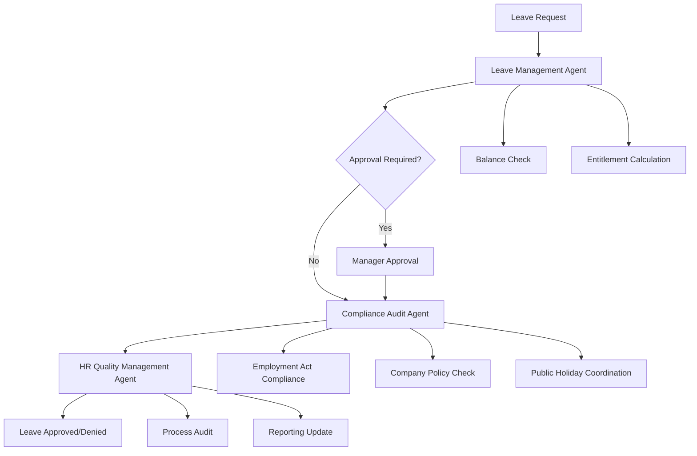

# Leave Management Workflow — Multi-Agent Automation

## Overview

This workflow automates the complete leave management process by orchestrating multiple AI agents to ensure accurate, compliant, and efficient leave administration. The workflow coordinates the Leave Management Agent, Compliance Audit Agent, and HR Quality Management Agent to handle leave requests, approvals, and reporting in accordance with Malaysian employment law.

## Workflow Architecture



## Participating Agents

### 1. Leave Management Agent
**Role**: Core leave processing and balance management
**Responsibilities**:
- Calculate leave entitlements
- Process leave requests
- Track leave balances
- Generate leave reports

### 2. Compliance Audit Agent
**Role**: Regulatory compliance verification
**Responsibilities**:
- Verify Employment Act compliance
- Check maternity/paternity leave eligibility
- Validate sick leave documentation
- Ensure public holiday coordination

### 3. HR Quality Management Agent
**Role**: Process quality and reporting
**Responsibilities**:
- Audit leave approval processes
- Monitor approval timeliness
- Generate compliance reports
- Identify process improvements

## Workflow Stages

### Stage 1: Leave Request Submission

**Trigger**: Employee submits leave request
**Coordinator**: Leave Management Agent

```yaml
actions:
  - agent: leave-management
    action: validate_request
    inputs:
      - employee_id
      - leave_type
      - dates_requested
      - reason
    outputs:
      - validation_status
      - available_balance
      - approval_requirements
  
  - agent: leave-management
    action: check_conflicts
    inputs:
      - requested_dates
      - team_schedule
      - company_holidays
    outputs:
      - conflict_status
      - alternative_dates
      - coverage_requirements
```

### Stage 2: Approval Process

**Trigger**: Valid leave request
**Coordinator**: Leave Management Agent

```yaml
actions:
  - agent: leave-management
    action: route_approval
    inputs:
      - leave_request
      - approval_hierarchy
      - business_rules
    outputs:
      - approvers_list
      - approval_deadlines
      - escalation_rules
  
  - agent: compliance-audit
    action: pre_approval_check
    inputs:
      - leave_type
      - employee_details
      - company_policy
    outputs:
      - compliance_status
      - required_documentation
      - approval_conditions
```

### Stage 3: Post-Approval Processing

**Trigger**: Leave approved
**Coordinator**: HR Quality Management Agent

```yaml
actions:
  - agent: leave-management
    action: update_balance
    inputs:
      - employee_id
      - leave_type
      - approved_days
    outputs:
      - new_balance
      - carry_forward_amount
      - expiry_date
  
  - agent: hr-quality-management
    action: audit_approval
    inputs:
      - approval_process
      - timeline_compliance
      - documentation_complete
    outputs:
      - quality_score
      - process_violations
      - improvement_recommendations
  
  - agent: compliance-audit
    action: final_compliance
    inputs:
      - approved_leave
      - regulatory_requirements
      - reporting_obligations
    outputs:
      - compliance_confirmation
      - reporting_status
      - audit_trail
```

## Leave Types & Entitlements

### Statutory Leave (Employment Act 1955)

```yaml
annual_leave:
  - entitlement: "8-16 days per year"
  - accrual: "Based on length of service"
  - carry_forward: "Up to 48 days maximum"
  - payment: "Paid at basic rate"

sick_leave:
  - entitlement: "14 days per year (after probation)"
  - certification: "MC required after 3 consecutive days"
  - payment: "60% of daily wages for first 60 days"

maternity_leave:
  - entitlement: "60 consecutive days"
  - eligibility: "After 90 days continuous service"
  - payment: "Full pay for first 42 days"

paternity_leave:
  - entitlement: "7 consecutive days"
  - eligibility: "Married employees"
  - payment: "Full pay"
```

### Company-Specific Leave

```yaml
emergency_leave:
  - entitlement: "3 days per year"
  - approval: "Immediate supervisor"
  - documentation: "Reason required"

compassionate_leave:
  - entitlement: "Up to 5 days"
  - occasions: "Death of immediate family"
  - approval: "HR approval required"
```

## Approval Workflows

### Standard Approval Matrix

```yaml
approval_matrix:
  non_executive:
    annual_leave: "Supervisor approval"
    sick_leave: "Auto-approve up to 3 days, Supervisor for longer"
    emergency_leave: "Supervisor approval"
    maternity_leave: "HR approval"
  
  executive:
    annual_leave: "Department head approval"
    sick_leave: "Auto-approve up to 3 days, Department head for longer"
    emergency_leave: "Department head approval"
    maternity_leave: "HR approval"
  
  director_level:
    annual_leave: "CEO approval"
    sick_leave: "HR approval"
    emergency_leave: "CEO approval"
    maternity_leave: "HR approval"
```

### Escalation Rules

```yaml
escalation_rules:
  response_time:
    supervisor: "24 hours"
    department_head: "48 hours"
    hr: "72 hours"
  
  auto_escalation:
    - condition: "No response within deadline"
    - action: "Escalate to next level"
    - notification: "Email + system alert"
```

## Quality Gates

### Gate 1: Request Validation
**Criteria**: All required information provided and valid
**Responsible Agent**: Leave Management Agent
**Success Metric**: 100% validation pass rate

### Gate 2: Compliance Verification
**Criteria**: Leave request meets all legal requirements
**Responsible Agent**: Compliance Audit Agent
**Success Metric**: Zero compliance violations

### Gate 3: Approval Timeliness
**Criteria**: Approvals completed within defined SLAs
**Responsible Agent**: HR Quality Management Agent
**Success Metric**: 95% on-time approval rate

### Gate 4: Balance Accuracy
**Criteria**: Leave balances correctly calculated and updated
**Responsible Agent**: Leave Management Agent
**Success Metric**: 100% balance accuracy

## Integration Points

### HRMS Integration
```typescript
interface LeaveWorkflow {
  // Request management
  submitLeaveRequest(request: LeaveRequest): Promise<RequestResult>
  getLeaveBalance(employeeId: string): Promise<LeaveBalance>
  getPendingRequests(employeeId: string): Promise<LeaveRequest[]>
  
  // Approval management
  approveLeave(requestId: string, approverId: string, comments?: string): Promise<ApprovalResult>
  rejectLeave(requestId: string, approverId: string, reason: string): Promise<RejectionResult>
  delegateApproval(requestId: string, delegateId: string): Promise<void>
  
  // Compliance checking
  validateCompliance(request: LeaveRequest): Promise<ComplianceResult>
  checkEntitlements(employeeId: string, leaveType: LeaveType): Promise<EntitlementCheck>
  
  // Reporting
  generateLeaveReport(filters: ReportFilters): Promise<LeaveReport>
  getLeaveAnalytics(employeeId: string, period: DateRange): Promise<LeaveAnalytics>
}
```

### Calendar Integration
```typescript
interface CalendarIntegration {
  // Schedule management
  checkAvailability(dates: Date[], employeeId: string): Promise<AvailabilityCheck>
  blockCalendar(requestId: string, dates: Date[]): Promise<void>
  updateCalendar(requestId: string, status: LeaveStatus): Promise<void>
  
  // Team coordination
  findCoverage(dates: Date[], departmentId: string): Promise<CoverageOptions>
  scheduleHandover(requestId: string, handoverDetails: HandoverDetails): Promise<void>
}
```

## Configuration Management

### Leave Policy Configuration
```yaml
leave_policy:
  version: "1.0.0"
  effective_date: "2026-01-01"
  
  entitlements:
    annual_leave:
      calculation: "service_based"
      tiers:
        - years: "0-2"
          days: 8
        - years: "2-5"
          days: 12
        - years: "5+"
          days: 16
      carry_forward_limit: 48
    
    sick_leave:
      annual_entitlement: 14
      certification_required_after: 3
      hospitalisation_extension: 60
  
  approval_rules:
    auto_approve_threshold: 3
    emergency_leave_limit: 3
    compassionate_leave_events: ["death", "critical_illness", "accident"]
  
  blackout_periods:
    - "Dec 20 - Jan 05"
    - "Chinese New Year period"
    - "Hari Raya period"
```

## Monitoring & Analytics

### Real-Time Dashboard
- **Pending Approvals**: Requests awaiting action
- **Leave Utilization**: Department and individual usage
- **Approval Timeliness**: SLA compliance tracking
- **Balance Monitoring**: Low balance alerts

### Management Reports
- **Leave Trends**: Monthly/quarterly utilization patterns
- **Absenteeism Analysis**: Unplanned leave patterns
- **Compliance Reports**: Regulatory compliance status
- **Cost Analysis**: Leave liability calculations

## Future Enhancements

### Phase 2 (Q2 2026)
- **Predictive Analytics**: Forecast leave utilization
- **AI-Powered Approval**: Intelligent routing based on patterns
- **Mobile Experience**: Leave management on mobile devices
- **Integration APIs**: Third-party calendar and scheduling systems

### Phase 3 (Q3 2026)
- **Advanced Scheduling**: AI-optimized leave planning
- **Workload Balancing**: Automated coverage optimization
- **Health Integration**: Medical leave coordination
- **Global Expansion**: Multi-country leave policies

## Conclusion

The Leave Management Workflow demonstrates how multiple AI agents can work together to create an efficient, compliant, and user-friendly leave management system. By automating routine tasks, ensuring regulatory compliance, and providing quality assurance, the workflow reduces administrative burden while improving employee experience and maintaining legal compliance.
