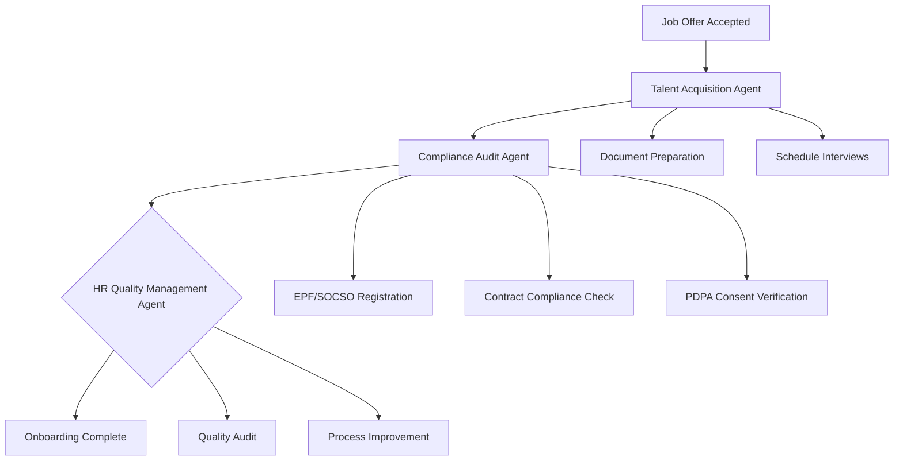

# New Hire Onboarding Workflow — Multi-Agent Orchestration

## Overview

This workflow automates the complete new hire onboarding process by orchestrating multiple AI agents to ensure compliance, quality, and efficiency. The workflow coordinates the Talent Acquisition Agent, Compliance Audit Agent, and HR Quality Management Agent to deliver a seamless onboarding experience.

## Workflow Architecture



## Participating Agents

### 1. Talent Acquisition Agent
**Role**: Document preparation and initial setup
**Responsibilities**:
- Generate employment contract
- Prepare offer letter
- Schedule onboarding sessions
- Create employee profile

### 2. Compliance Audit Agent
**Role**: Regulatory compliance verification
**Responsibilities**:
- Verify EPF/SOCSO registration requirements
- Check contract compliance with Employment Act
- Validate PDPA consent collection
- Confirm work permit validity (foreign workers)

### 3. HR Quality Management Agent
**Role**: Process quality assurance
**Responsibilities**:
- Audit onboarding completeness
- Verify document quality
- Monitor SLA compliance
- Generate quality metrics

## Workflow Stages

### Stage 1: Pre-Onboarding (Day -7 to Day 0)

**Trigger**: Job offer acceptance
**Coordinator**: Talent Acquisition Agent

```yaml
actions:
  - agent: talent-acquisition
    action: prepare_documents
    inputs:
      - employee_id
      - position_details
      - start_date
    outputs:
      - employment_contract
      - offer_letter
      - onboarding_schedule
  
  - agent: compliance-audit
    action: pre_hire_check
    inputs:
      - employee_details
      - work_eligibility
    outputs:
      - compliance_status
      - required_documents
      - risk_assessment
```

### Stage 2: Onboarding Day (Day 0)

**Trigger**: Employee start date
**Coordinator**: HR Quality Management Agent

```yaml
actions:
  - agent: hr-quality-management
    action: onboarding_audit
    inputs:
      - employee_id
      - completed_tasks
    outputs:
      - quality_score
      - missing_items
      - improvement_recommendations
  
  - agent: compliance-audit
    action: document_verification
    inputs:
      - submitted_documents
      - compliance_requirements
    outputs:
      - verification_status
      - compliance_issues
      - remediation_steps
```

### Stage 3: Post-Onboarding (Day 1-30)

**Trigger**: Daily monitoring
**Coordinator**: Multi-agent coordination

```yaml
actions:
  - agent: talent-acquisition
    action: follow_up_check
    inputs:
      - employee_id
      - feedback_data
    outputs:
      - satisfaction_score
      - improvement_areas
  
  - agent: compliance-audit
    action: ongoing_compliance
    inputs:
      - employee_records
      - regulatory_updates
    outputs:
      - compliance_alerts
      - required_actions
```

## Quality Gates

### Gate 1: Document Completeness
**Criteria**: All required documents submitted and verified
**Responsible Agent**: Compliance Audit Agent
**Success Metric**: 100% document completion rate

### Gate 2: Compliance Verification
**Criteria**: All regulatory requirements met
**Responsible Agent**: Compliance Audit Agent
**Success Metric**: Zero compliance violations

### Gate 3: Process Quality
**Criteria**: Onboarding process meets quality standards
**Responsible Agent**: HR Quality Management Agent
**Success Metric**: Quality score > 95%

### Gate 4: Employee Satisfaction
**Criteria**: New hire feedback meets targets
**Responsible Agent**: Talent Acquisition Agent
**Success Metric**: Satisfaction score > 4.0/5.0

## Error Handling & Escalation

### Error Types
- **Document Missing**: Automatic reminder system
- **Compliance Failure**: Immediate escalation to HR manager
- **Quality Issue**: CAPA process initiation
- **System Error**: Technical support notification

### Escalation Matrix
```yaml
critical_errors:
  - compliance_violation
  - missing_mandatory_documents
  - system_failure
  
escalation_levels:
  level_1: "HR Coordinator (response: 4 hours)"
  level_2: "HR Manager (response: 24 hours)"
  level_3: "HR Director (response: immediate)"
```

## Performance Metrics

### Workflow KPIs
- **Completion Rate**: % of hires completing onboarding successfully
- **Time to Productivity**: Average days to full productivity
- **Compliance Score**: % of hires with zero compliance issues
- **Quality Score**: Average onboarding quality rating
- **Cost per Hire**: Total onboarding cost including agent processing

### Agent Performance
- **Response Time**: Average time for agent actions
- **Accuracy Rate**: % of correct agent decisions
- **Error Rate**: % of failed agent actions
- **Satisfaction Score**: User feedback on agent assistance

## Integration Points

### HRMS Integration
```typescript
interface OnboardingWorkflow {
  // Workflow management
  startWorkflow(employeeId: string): Promise<WorkflowInstance>
  getWorkflowStatus(workflowId: string): Promise<WorkflowStatus>
  updateWorkflowStep(workflowId: string, stepId: string, status: StepStatus): Promise<void>
  
  // Agent coordination
  coordinateAgents(workflowId: string, action: WorkflowAction): Promise<AgentResponse[]>
  handleAgentResponse(workflowId: string, agentResponse: AgentResponse): Promise<void>
  
  // Quality monitoring
  monitorQuality(workflowId: string): Promise<QualityMetrics>
  generateReport(workflowId: string): Promise<OnboardingReport>
}
```

### External System Integration
- **EPF Portal**: Automatic registration verification
- **SOCSO System**: Contribution eligibility checking
- **MyFutureJobs**: Compliance reporting
- **Email Systems**: Automated notifications
- **Calendar Systems**: Meeting scheduling

## Configuration Management

### Workflow Configuration
```yaml
workflow_config:
  version: "1.0.0"
  agents:
    talent_acquisition:
      version: "2.1"
      endpoints:
        - prepare_documents
        - schedule_onboarding
    compliance_audit:
      version: "1.0"
      endpoints:
        - verify_compliance
        - check_documents
    hr_quality_management:
      version: "1.0"
      endpoints:
        - audit_process
        - generate_report
  
  quality_gates:
    document_completeness: 100
    compliance_score: 95
    quality_rating: 4.5
  
  sla_targets:
    document_preparation: "2 hours"
    compliance_check: "4 hours"
    quality_audit: "24 hours"
```

## Monitoring & Analytics

### Real-Time Dashboard
- **Workflow Status**: Current stage and progress
- **Agent Performance**: Response times and success rates
- **Quality Metrics**: Compliance and satisfaction scores
- **Bottleneck Identification**: Process delays and issues

### Analytics Reports
- **Monthly Summary**: Overall workflow performance
- **Agent Effectiveness**: Individual agent contribution
- **Process Improvements**: Identified optimization opportunities
- **Compliance Trends**: Regulatory compliance patterns

## Future Enhancements

### Phase 2 (Q2 2026)
- **Predictive Analytics**: Anticipate onboarding issues
- **Personalization**: AI-driven customized onboarding
- **Mobile Integration**: Mobile-first onboarding experience
- **Multi-language Support**: Bahasa Malaysia interfaces

### Phase 3 (Q3 2026)
- **Self-Optimization**: AI learns from successful patterns
- **Advanced Orchestration**: Complex conditional workflows
- **External Integrations**: Third-party system connections
- **Global Expansion**: Support for international hires

## Conclusion

The New Hire Onboarding Workflow demonstrates the power of multi-agent orchestration in streamlining complex HR processes. By coordinating specialized AI agents, organizations can achieve higher compliance rates, better quality assurance, and improved employee experiences while reducing manual effort and minimizing risks.
