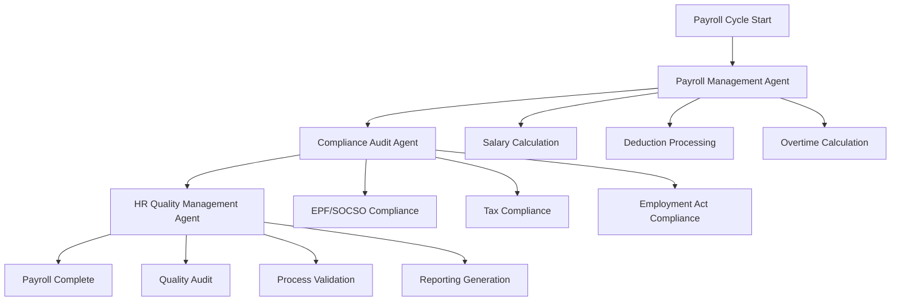

# Payroll Processing Workflow — Multi-Agent Orchestration

## Overview

This workflow automates the complete payroll processing cycle by orchestrating multiple AI agents to ensure accurate, timely, and compliant salary administration. The workflow coordinates the Payroll Management Agent, Compliance Audit Agent, and HR Quality Management Agent to handle salary calculations, statutory deductions, and regulatory reporting.

## Workflow Architecture



## Participating Agents

### 1. Payroll Management Agent
**Role**: Core payroll calculation and processing
**Responsibilities**:
- Calculate gross and net salaries
- Process statutory deductions
- Handle overtime and allowances
- Generate payslips and reports

### 2. Compliance Audit Agent
**Role**: Regulatory compliance verification
**Responsibilities**:
- Verify EPF/SOCSO contribution calculations
- Ensure tax compliance and filings
- Validate minimum wage requirements
- Check employment contract compliance

### 3. HR Quality Management Agent
**Role**: Process quality and accuracy assurance
**Responsibilities**:
- Audit payroll calculations
- Validate data accuracy
- Monitor processing timeliness
- Generate quality metrics and reports

## Workflow Stages

### Stage 1: Pre-Payroll Preparation

**Trigger**: Payroll cycle start (typically monthly)
**Coordinator**: Payroll Management Agent

```yaml
actions:
  - agent: payroll-management
    action: gather_payroll_data
    inputs:
      - employee_list
      - attendance_records
      - overtime_hours
      - salary_changes
    outputs:
      - payroll_input_data
      - data_validation_report
      - missing_data_alerts
  
  - agent: payroll-management
    action: calculate_gross_pay
    inputs:
      - base_salary
      - allowances
      - overtime_hours
      - incentives
    outputs:
      - gross_pay_amounts
      - calculation_breakdown
      - adjustment_recommendations
```

### Stage 2: Deduction Processing

**Trigger**: Gross pay calculated
**Coordinator**: Compliance Audit Agent

```yaml
actions:
  - agent: compliance-audit
    action: calculate_statutory_deductions
    inputs:
      - gross_pay
      - employee_details
      - statutory_rates
    outputs:
      - epf_deduction
      - socso_deduction
      - eis_deduction
      - compliance_status
  
  - agent: compliance-audit
    action: calculate_income_tax
    inputs:
      - gross_pay
      - tax_brackets
      - reliefs_claimed
      - previous_tax_paid
    outputs:
      - monthly_tax_deduction
      - tax_compliance_status
      - year_to_date_tax
  
  - agent: payroll-management
    action: process_other_deductions
    inputs:
      - voluntary_deductions
      - loan_repayments
      - insurance_premiums
    outputs:
      - total_deductions
      - net_pay_amounts
```

### Stage 3: Final Processing & Distribution

**Trigger**: All calculations complete
**Coordinator**: HR Quality Management Agent

```yaml
actions:
  - agent: hr-quality-management
    action: audit_payroll_accuracy
    inputs:
      - calculated_payroll
      - historical_data
      - benchmark_rates
    outputs:
      - accuracy_score
      - variance_analysis
      - audit_recommendations
  
  - agent: payroll-management
    action: generate_payslips
    inputs:
      - payroll_data
      - employee_details
      - company_information
    outputs:
      - individual_payslips
      - payroll_summary
      - distribution_list
  
  - agent: compliance-audit
    action: prepare_statutory_filings
    inputs:
      - payroll_data
      - regulatory_requirements
      - filing_deadlines
    outputs:
      - epf_monthly_return
      - socso_contribution_report
      - tax_deduction_forms
```

## Statutory Compliance Requirements

### EPF (Employees Provident Fund)

```yaml
epf_requirements:
  employee_contribution:
    rate: "11% of basic salary + allowances"
    minimum: "RM5.00 per month"
    maximum: "RM2,060.80 per month (2026 rates)"
  
  employer_contribution:
    rate: "13% of basic salary + allowances"
    minimum: "RM6.50 per month"
    maximum: "RM2,679.04 per month (2026 rates)"
  
  filing_deadline: "By 15th of following month"
  penalty: "RM100-500 per late submission"
```

### SOCSO (Social Security Organization)

```yaml
socso_requirements:
  employee_contribution:
    rate: "0.5% of insurable wages"
    maximum_wage: "RM4,000 per month"
  
  employer_contribution:
    rate: "1.75% of insurable wages"
    maximum_wage: "RM4,000 per month"
  
  invalidity_scheme:
    employee: "0.5%"
    employer: "1.25%"
  
  filing_deadline: "By 31st of following month"
```

### Income Tax Deductions

```yaml
tax_deduction:
  method: "Monthly Tax Deduction (MTD)"
  calculation: "Based on current year tax brackets"
  filing: "Form CP39 submission"
  deadline: "By 31st January following year"
  
  tax_brackets_2026:
    - range: "0 - 5,000"
      rate: "0%"
    - range: "5,001 - 20,000"
      rate: "1%"
    - range: "20,001 - 35,000"
      rate: "3%"
    - range: "35,001 - 50,000"
      rate: "6%"
    - range: "50,001 - 70,000"
      rate: "11%"
    - range: "70,001 - 100,000"
      rate: "19%"
    - range: "100,001 - 250,000"
      rate: "25%"
    - range: "250,001+"
      rate: "28%"
```

## Quality Gates

### Gate 1: Data Accuracy
**Criteria**: All payroll data validated and complete
**Responsible Agent**: Payroll Management Agent
**Success Metric**: 100% data validation pass rate

### Gate 2: Calculation Accuracy
**Criteria**: All calculations verified against benchmarks
**Responsible Agent**: HR Quality Management Agent
**Success Metric**: Zero calculation errors

### Gate 3: Compliance Verification
**Criteria**: All statutory requirements met
**Responsible Agent**: Compliance Audit Agent
**Success Metric**: 100% compliance rate

### Gate 4: Timely Processing
**Criteria**: Payroll completed by deadline
**Responsible Agent**: HR Quality Management Agent
**Success Metric**: 100% on-time completion rate

## Error Handling & Corrections

### Common Error Types
- **Data Entry Errors**: Incorrect salary or allowance amounts
- **Calculation Errors**: Wrong deduction percentages
- **Compliance Errors**: Incorrect statutory contribution rates
- **Timing Errors**: Late processing or filing

### Correction Process
```yaml
correction_workflow:
  - Identify error type and impact
  - Calculate correction amount
  - Prepare adjustment entries
  - Obtain approval for corrections
  - Process corrective payroll
  - Update employee records
  - File amended statutory returns if required
```

## Integration Points

### HRMS Integration
```typescript
interface PayrollWorkflow {
  // Payroll processing
  startPayrollCycle(cycleConfig: PayrollCycle): Promise<CycleInstance>
  processPayrollData(employeeData: EmployeePayrollData[]): Promise<PayrollResult>
  calculatePayroll(employeeId: string, payPeriod: PayPeriod): Promise<PayrollCalculation>
  
  // Compliance management
  validateCompliance(payrollData: PayrollData): Promise<ComplianceResult>
  generateStatutoryReports(reportType: StatutoryReportType): Promise<ReportData>
  fileStatutoryReturns(returnData: ReturnData): Promise<FilingResult>
  
  // Quality assurance
  auditPayrollCalculations(payrollId: string): Promise<AuditResult>
  validatePayrollAccuracy(payrollData: PayrollData): Promise<ValidationResult>
  
  // Distribution
  generatePayslips(payrollId: string): Promise<PayslipData[]>
  distributePayroll(payrollId: string, method: DistributionMethod): Promise<DistributionResult>
}
```

### Banking Integration
```typescript
interface BankingIntegration {
  // Payment processing
  initiateBulkTransfer(transferData: BulkTransferData): Promise<TransferResult>
  verifyPaymentStatus(referenceId: string): Promise<PaymentStatus>
  handlePaymentFailures(failedPayments: FailedPayment[]): Promise<RecoveryResult>
  
  // Account management
  validateBankDetails(employeeId: string): Promise<ValidationResult>
  updateBankDetails(employeeId: string, bankDetails: BankDetails): Promise<void>
}
```

## Configuration Management

### Payroll Configuration
```yaml
payroll_config:
  version: "1.0.0"
  pay_period: "monthly"
  pay_date: "25th of each month"
  currency: "MYR"
  
  statutory_rates:
    epf_employee: 0.11
    epf_employer: 0.13
    socso_employee: 0.005
    socso_employer: 0.0175
    eis_employer: 0.002
  
  tax_config:
    tax_year: 2026
    tax_brackets: [...]
    personal_relief: 9000
    additional_reliefs: [...]
  
  processing_rules:
    overtime_rate: 1.5
    minimum_wage: 1500
    working_days_month: 26
```

## Monitoring & Analytics

### Real-Time Dashboard
- **Processing Status**: Current payroll cycle progress
- **Error Monitoring**: Calculation and compliance issues
- **Compliance Status**: Statutory filing status
- **Payment Confirmation**: Salary crediting status

### Management Reports
- **Payroll Summary**: Monthly payroll costs and distributions
- **Compliance Reports**: Statutory contribution and tax filings
- **Cost Analysis**: Salary and benefit expense trends
- **Audit Reports**: Payroll accuracy and quality metrics

## Future Enhancements

### Phase 2 (Q2 2026)
- **Predictive Analytics**: Forecast payroll costs and variances
- **AI-Assisted Auditing**: Automated error detection and correction
- **Self-Service Portal**: Employee payroll information access
- **Multi-Currency Support**: International payroll capabilities

### Phase 3 (Q3 2026)
- **Real-Time Payroll**: Continuous payroll updates
- **Advanced Tax Optimization**: Tax-efficient compensation planning
- **Blockchain Integration**: Immutable payroll records
- **Global Payroll**: Multi-country payroll processing

## Conclusion

The Payroll Processing Workflow illustrates the critical role of multi-agent orchestration in ensuring accurate, compliant, and efficient payroll administration. By coordinating specialized agents for calculation, compliance, and quality assurance, organizations can minimize errors, ensure regulatory compliance, and maintain employee trust in the payroll process.
