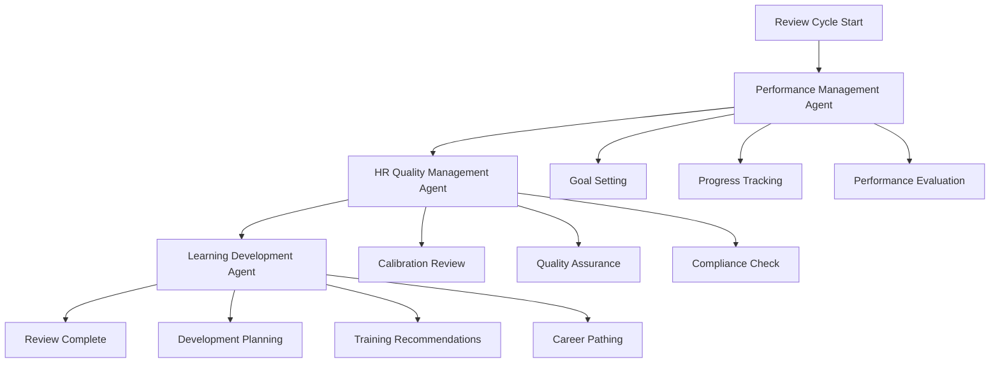

# Performance Management Workflow — Multi-Agent Coordination

## Overview

This workflow automates the complete performance management cycle by orchestrating multiple AI agents to ensure fair, compliant, and effective performance evaluations. The workflow coordinates the Performance Management Agent, HR Quality Management Agent, and Learning Development Agent to deliver comprehensive performance reviews with actionable development plans.

## Workflow Architecture



## Participating Agents

### 1. Performance Management Agent
**Role**: Core performance evaluation and goal management
**Responsibilities**:
- Facilitate goal setting and tracking
- Conduct performance assessments
- Generate performance reports
- Monitor progress against objectives

### 2. HR Quality Management Agent
**Role**: Process quality and compliance assurance
**Responsibilities**:
- Audit evaluation fairness and consistency
- Ensure compliance with HR policies
- Validate calibration processes
- Monitor review quality metrics

### 3. Learning Development Agent
**Role**: Employee development and training coordination
**Responsibilities**:
- Analyze skill gaps from performance data
- Recommend training programs
- Create individual development plans
- Track learning progress and outcomes

## Workflow Stages

### Stage 1: Planning & Goal Setting (Quarter Start)

**Trigger**: Performance cycle initiation
**Coordinator**: Performance Management Agent

```yaml
actions:
  - agent: performance-management
    action: initialize_cycle
    inputs:
      - employee_list
      - cycle_parameters
      - organizational_goals
    outputs:
      - performance_plans
      - goal_templates
      - review_schedule
  
  - agent: hr-quality-management
    action: validate_framework
    inputs:
      - performance_framework
      - compliance_requirements
    outputs:
      - validation_status
      - compliance_gaps
      - recommended_adjustments
```

### Stage 2: Mid-Cycle Review (Quarter Midpoint)

**Trigger**: Mid-cycle checkpoint
**Coordinator**: Performance Management Agent

```yaml
actions:
  - agent: performance-management
    action: mid_cycle_review
    inputs:
      - employee_id
      - current_performance
      - goal_progress
    outputs:
      - progress_report
      - adjustment_recommendations
      - coaching_notes
  
  - agent: learning-development
    action: skill_assessment
    inputs:
      - performance_data
      - competency_gaps
    outputs:
      - skill_gap_analysis
      - training_needs
      - development_priorities
```

### Stage 3: Annual Performance Review (Year End)

**Trigger**: Annual review period
**Coordinator**: HR Quality Management Agent

```yaml
actions:
  - agent: performance-management
    action: annual_evaluation
    inputs:
      - employee_id
      - annual_performance_data
      - stakeholder_feedback
    outputs:
      - performance_rating
      - achievement_summary
      - improvement_areas
  
  - agent: hr-quality-management
    action: calibration_session
    inputs:
      - performance_ratings
      - department_data
      - organizational_distribution
    outputs:
      - calibrated_ratings
      - calibration_report
      - fairness_assessment
  
  - agent: learning-development
    action: development_planning
    inputs:
      - performance_results
      - career_aspirations
      - organizational_needs
    outputs:
      - development_plan
      - training_recommendations
      - career_path_options
```

## Quality Gates

### Gate 1: Goal Clarity
**Criteria**: All performance goals are SMART and measurable
**Responsible Agent**: Performance Management Agent
**Success Metric**: 100% goal completion rate

### Gate 2: Evaluation Fairness
**Criteria**: Performance ratings follow calibration guidelines
**Responsible Agent**: HR Quality Management Agent
**Success Metric**: Calibration variance < 15%

### Gate 3: Development Planning
**Criteria**: All employees have actionable development plans
**Responsible Agent**: Learning Development Agent
**Success Metric**: 95% plan completion within 30 days

### Gate 4: Process Compliance
**Criteria**: All reviews meet regulatory and policy requirements
**Responsible Agent**: HR Quality Management Agent
**Success Metric**: Zero compliance violations

## Calibration Process

### Manager Calibration
```yaml
process:
  - Collect individual ratings from managers
  - Identify rating distribution patterns
  - Flag outliers for discussion
  - Facilitate calibration meetings
  - Document calibration decisions
  - Update final ratings
```

### Cross-Department Calibration
```yaml
process:
  - Aggregate ratings across departments
  - Analyze distribution curves
  - Identify systemic biases
  - Coordinate executive review
  - Finalize organization-wide ratings
```

## Performance Rating Scale

### Malaysian Context Adaptation
```yaml
rating_scale:
  5: "Outstanding"    # Exceeds expectations significantly
  4: "Exceeds"        # Consistently exceeds expectations
  3: "Meets"          # Meets expectations fully
  2: "Below"          # Occasionally below expectations
  1: "Unsatisfactory" # Consistently below expectations
```

### Rating Distribution Guidelines
- **Outstanding (5)**: Top 10% of performers
- **Exceeds (4)**: Next 20% of performers
- **Meets (3)**: Middle 40% of performers
- **Below (2)**: Next 20% of performers
- **Unsatisfactory (1)**: Bottom 10% of performers

## Development Planning Integration

### Individual Development Plan (IDP) Structure
```yaml
idp_components:
  - skill_gaps: "Identified from performance review"
  - training_needs: "Recommended learning interventions"
  - career_goals: "Short-term and long-term objectives"
  - action_items: "Specific, measurable actions"
  - timelines: "Realistic completion dates"
  - success_metrics: "How progress will be measured"
```

### Training Recommendation Engine
```yaml
recommendation_logic:
  - Analyze performance gaps
  - Match against available training programs
  - Consider budget constraints
  - Prioritize high-impact development areas
  - Schedule optimal timing
  - Track completion and effectiveness
```

## Analytics & Insights

### Performance Trends
- **Rating Distribution**: Year-over-year comparison
- **Department Performance**: Comparative analysis
- **Diversity & Inclusion**: Representation in ratings
- **Retention Correlation**: Performance vs. turnover

### Development Impact
- **Training Effectiveness**: Performance improvement post-training
- **Skill Development**: Competency growth tracking
- **Career Progression**: Promotion and advancement rates
- **Employee Engagement**: Satisfaction with development process

## Integration Points

### HRMS Integration
```typescript
interface PerformanceWorkflow {
  // Cycle management
  startPerformanceCycle(cycleConfig: CycleConfig): Promise<CycleInstance>
  getCycleStatus(cycleId: string): Promise<CycleStatus>
  updateEmployeeReview(cycleId: string, employeeId: string, reviewData: ReviewData): Promise<void>
  
  // Calibration management
  scheduleCalibration(sessionConfig: CalibrationConfig): Promise<CalibrationSession>
  submitCalibrationRating(sessionId: string, employeeId: string, rating: Rating): Promise<void>
  finalizeCalibration(sessionId: string): Promise<CalibrationResult>
  
  // Development planning
  createDevelopmentPlan(employeeId: string, performanceData: PerformanceData): Promise<DevelopmentPlan>
  updatePlanProgress(planId: string, progress: ProgressUpdate): Promise<void>
  
  // Analytics
  generatePerformanceReport(cycleId: string, filters: ReportFilters): Promise<PerformanceReport>
  getInsights(cycleId: string): Promise<PerformanceInsights>
}
```

## Configuration Management

### Workflow Configuration
```yaml
performance_config:
  version: "1.0.0"
  cycle_type: "annual"
  rating_scale: [1, 2, 3, 4, 5]
  calibration_required: true
  development_planning: true
  
  timelines:
    goal_setting: "Q1 Start"
    mid_year_review: "Q2 Mid"
    annual_review: "Q4 End"
    calibration: "Q4 End + 2 weeks"
  
  quality_thresholds:
    goal_completion: 0.95
    calibration_variance: 0.15
    development_plan_completion: 0.90
```

## Monitoring & Reporting

### Real-Time Dashboard
- **Cycle Progress**: Completion status across organization
- **Calibration Status**: Session scheduling and completion
- **Quality Metrics**: Process compliance and fairness scores
- **Development Tracking**: Plan completion and training enrollment

### Executive Reports
- **Performance Summary**: Organization-wide results
- **Talent Insights**: High-potential identification
- **Development ROI**: Training investment returns
- **Succession Planning**: Critical role coverage

## Future Enhancements

### Phase 2 (Q2 2026)
- **Continuous Feedback**: Real-time performance input
- **Predictive Analytics**: Performance trend forecasting
- **AI-Assisted Calibration**: Automated fairness algorithms
- **Mobile Experience**: Performance management on mobile devices

### Phase 3 (Q3 2026)
- **360-Degree Feedback**: Multi-rater assessment integration
- **Competency Frameworks**: Dynamic skill modeling
- **Succession Integration**: Automated talent pipeline management
- **Global Standardization**: Multi-country performance processes

## Conclusion

The Performance Management Workflow showcases the integration of multiple AI agents to create a comprehensive, compliant, and effective performance management system. By leveraging specialized agents for evaluation, quality assurance, and development planning, organizations can ensure fair assessments, targeted development, and continuous improvement while maintaining regulatory compliance.
