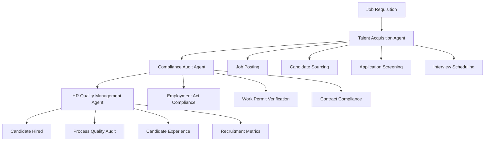

# Talent Acquisition Workflow — Multi-Agent Recruitment Automation

## Overview

This workflow automates the complete talent acquisition process by orchestrating multiple AI agents to ensure efficient, compliant, and effective recruitment. The workflow coordinates the Talent Acquisition Agent, Compliance Audit Agent, and HR Quality Management Agent to manage job postings, candidate screening, interviews, and onboarding handoffs.

## Workflow Architecture



## Participating Agents

### 1. Talent Acquisition Agent
**Role**: Core recruitment process management
**Responsibilities**:
- Create and publish job descriptions
- Source and attract candidates
- Screen applications and resumes
- Coordinate interview processes
- Manage candidate communications

### 2. Compliance Audit Agent
**Role**: Regulatory compliance verification
**Responsibilities**:
- Verify work permit and visa requirements
- Ensure fair hiring practices
- Check employment contract compliance
- Validate background check processes
- Monitor diversity and inclusion metrics

### 3. HR Quality Management Agent
**Role**: Process quality and candidate experience
**Responsibilities**:
- Audit recruitment process quality
- Monitor time-to-hire metrics
- Assess candidate satisfaction
- Generate recruitment analytics
- Identify process improvements

## Workflow Stages

### Stage 1: Job Requisition & Posting

**Trigger**: New job requisition approved
**Coordinator**: Talent Acquisition Agent

```yaml
actions:
  - agent: talent-acquisition
    action: create_job_description
    inputs:
      - job_requisition
      - role_requirements
      - company_branding
    outputs:
      - job_description
      - posting_content
      - application_form
  
  - agent: compliance-audit
    action: review_job_posting
    inputs:
      - job_description
      - employment_laws
      - company_policies
    outputs:
      - compliance_status
      - recommended_changes
      - legal_disclaimers
  
  - agent: talent-acquisition
    action: publish_job_posting
    inputs:
      - approved_content
      - target_channels
      - posting_schedule
    outputs:
      - posting_urls
      - publication_status
      - initial_analytics
```

### Stage 2: Candidate Sourcing & Screening

**Trigger**: Job posting live
**Coordinator**: Talent Acquisition Agent

```yaml
actions:
  - agent: talent-acquisition
    action: source_candidates
    inputs:
      - job_requirements
      - target_candidates
      - sourcing_channels
    outputs:
      - candidate_pool
      - sourcing_metrics
      - diversity_statistics
  
  - agent: talent-acquisition
    action: screen_applications
    inputs:
      - application_data
      - screening_criteria
      - qualification_requirements
    outputs:
      - shortlisted_candidates
      - screening_report
      - rejection_reasons
  
  - agent: compliance-audit
    action: verify_eligibility
    inputs:
      - candidate_details
      - work_eligibility
      - background_check_requirements
    outputs:
      - eligibility_status
      - required_verifications
      - compliance_flags
```

### Stage 3: Interview & Selection Process

**Trigger**: Candidates shortlisted
**Coordinator**: HR Quality Management Agent

```yaml
actions:
  - agent: talent-acquisition
    action: schedule_interviews
    inputs:
      - candidate_list
      - interviewer_availability
      - interview_format
    outputs:
      - interview_schedule
      - candidate_notifications
      - interviewer_briefings
  
  - agent: hr-quality-management
    action: monitor_interview_process
    inputs:
      - interview_feedback
      - process_timelines
      - candidate_experience
    outputs:
      - quality_assessment
      - process_improvements
      - satisfaction_scores
  
  - agent: talent-acquisition
    action: evaluate_candidates
    inputs:
      - interview_feedback
      - assessment_results
      - hiring_criteria
    outputs:
      - candidate_rankings
      - selection_recommendations
      - offer_preparation
```

### Stage 4: Offer & Onboarding Handoff

**Trigger**: Final candidate selected
**Coordinator**: Compliance Audit Agent

```yaml
actions:
  - agent: compliance-audit
    action: prepare_offer_letter
    inputs:
      - candidate_details
      - employment_terms
      - legal_requirements
    outputs:
      - offer_letter
      - contract_terms
      - compliance_checklist
  
  - agent: talent-acquisition
    action: extend_offer
    inputs:
      - offer_package
      - candidate_response
      - negotiation_terms
    outputs:
      - offer_status
      - acceptance_details
      - start_date_confirmation
  
  - agent: hr-quality-management
    action: handover_to_onboarding
    inputs:
      - new_hire_details
      - onboarding_requirements
      - recruitment_feedback
    outputs:
      - onboarding_package
      - process_completion_report
      - recruitment_metrics
```

## Compliance Requirements

### Employment Act 1955 Compliance

```yaml
employment_compliance:
  minimum_wage: "RM1,500 per month (2026 rates)"
  working_hours: "8 hours per day, 48 hours per week"
  rest_days: "1 rest day per week"
  public_holidays: "11 paid public holidays per year"
  annual_leave: "8-16 days based on service"
  
  prohibited_practices:
    - Age discrimination
    - Gender discrimination
    - Religious discrimination
    - Marital status discrimination
    - Disability discrimination
```

### Work Permit Requirements

```yaml
work_permit_checklist:
  foreign_workers:
    - Valid work permit
    - Medical examination certificate
    - Security clearance
    - Employment pass (for professionals)
  
  verification_process:
    - Document authenticity check
    - Validity period confirmation
    - Employer authorization
    - Immigration compliance
```

### Fair Hiring Practices

```yaml
fair_hiring:
  equal_opportunity: "All candidates treated equally"
  transparent_criteria: "Clear job requirements and evaluation criteria"
  documented_process: "All decisions recorded and auditable"
  appeal_process: "Candidates can appeal hiring decisions"
```

## Quality Gates

### Gate 1: Job Posting Compliance
**Criteria**: Job description meets legal requirements
**Responsible Agent**: Compliance Audit Agent
**Success Metric**: 100% compliance approval rate

### Gate 2: Candidate Experience
**Criteria**: Positive candidate feedback on process
**Responsible Agent**: HR Quality Management Agent
**Success Metric**: Average satisfaction score > 4.0/5.0

### Gate 3: Time-to-Hire
**Criteria**: Positions filled within target timeframe
**Responsible Agent**: Talent Acquisition Agent
**Success Metric**: 80% of positions filled within 45 days

### Gate 4: Offer Acceptance Rate
**Criteria**: High percentage of offers accepted
**Responsible Agent**: Talent Acquisition Agent
**Success Metric**: Offer acceptance rate > 70%

## Recruitment Analytics

### Key Performance Indicators

```yaml
kpi_definitions:
  time_to_hire:
    calculation: "Days from job posting to offer acceptance"
    target: "< 45 days"
    benchmark: "Industry average 39 days"
  
  cost_per_hire:
    calculation: "Total recruitment cost ÷ number of hires"
    target: "< RM5,000"
    benchmark: "Industry average RM4,200"
  
  quality_of_hire:
    calculation: "New hire performance vs. expectations"
    target: "> 80% success rate"
    measurement_period: "6 months post-hire"
  
  diversity_hire_rate:
    calculation: "Percentage of diverse candidates hired"
    target: "> 30%"
    categories: ["gender", "ethnicity", "age_group"]
```

### Analytics Dashboard

- **Pipeline Metrics**: Candidates at each stage
- **Source Effectiveness**: Best performing recruitment channels
- **Interview Conversion**: Success rates by stage
- **Offer Metrics**: Acceptance rates and time-to-accept

## Integration Points

### HRMS Integration
```typescript
interface RecruitmentWorkflow {
  // Job management
  createJobRequisition(requisition: JobRequisition): Promise<RequisitionResult>
  publishJobPosting(jobId: string, channels: PostingChannel[]): Promise<PostingResult>
  updateJobStatus(jobId: string, status: JobStatus): Promise<void>
  
  // Candidate management
  addCandidate(jobId: string, candidate: CandidateData): Promise<CandidateResult>
  updateCandidateStatus(candidateId: string, status: CandidateStatus): Promise<void>
  scheduleInterview(candidateId: string, interviewDetails: InterviewDetails): Promise<InterviewResult>
  
  // Compliance checking
  validateCompliance(candidateId: string): Promise<ComplianceResult>
  performBackgroundCheck(candidateId: string): Promise<BackgroundCheckResult>
  
  // Analytics
  getRecruitmentMetrics(jobId: string, period: DateRange): Promise<RecruitmentMetrics>
  generateRecruitmentReport(filters: ReportFilters): Promise<RecruitmentReport>
}
```

### ATS Integration
```typescript
interface ATSIntegration {
  // Application management
  importApplications(jobId: string, source: ApplicationSource): Promise<ApplicationData[]>
  exportCandidates(candidateIds: string[]): Promise<ExportResult>
  
  // Communication
  sendCandidateEmail(candidateId: string, template: EmailTemplate, data: EmailData): Promise<EmailResult>
  scheduleAutomatedEmails(workflowId: string, triggers: EmailTrigger[]): Promise<void>
  
  // Reporting
  syncApplicationData(jobId: string): Promise<SyncResult>
  getApplicationAnalytics(jobId: string): Promise<ApplicationAnalytics>
}
```

## Configuration Management

### Recruitment Configuration
```yaml
recruitment_config:
  version: "1.0.0"
  default_channels:
    - "JobStreet"
    - "LinkedIn"
    - "Company Website"
    - "Employee Referrals"
  
  screening_criteria:
    must_have:
      - "Required qualifications"
      - "Experience level"
      - "Language proficiency"
    nice_to_have:
      - "Additional certifications"
      - "Industry experience"
  
  interview_process:
    stages:
      - "Phone screening"
      - "Technical interview"
      - "Panel interview"
      - "Final interview"
    interviewers_per_stage: [1, 2, 3, 2]
  
  offer_templates:
    standard_offer:
      components: ["salary", "benefits", "start_date", "conditions"]
    management_offer:
      components: ["salary", "bonus", "equity", "conditions"]
```

## Monitoring & Reporting

### Real-Time Dashboard
- **Active Requisitions**: Current open positions
- **Pipeline Status**: Candidates in each stage
- **Interview Schedule**: Upcoming interviews
- **Offer Status**: Pending offer responses

### Management Reports
- **Recruitment Summary**: Monthly hiring activity
- **Channel Performance**: ROI by recruitment source
- **Diversity Reports**: Hiring diversity metrics
- **Quality Metrics**: Time-to-hire and cost analysis

## Future Enhancements

### Phase 2 (Q2 2026)
- **AI-Powered Screening**: Automated candidate evaluation
- **Predictive Analytics**: Forecast hiring needs and success
- **Video Interviewing**: Remote interview capabilities
- **Candidate Persona Matching**: Advanced candidate-job matching

### Phase 3 (Q3 2026)
- **Global Recruitment**: International candidate sourcing
- **Skills-Based Hiring**: Competency-focused recruitment
- **Continuous Sourcing**: Always-on talent pipeline
- **Blockchain Verification**: Digital credential validation

## Conclusion

The Talent Acquisition Workflow demonstrates the power of multi-agent orchestration in creating an efficient, compliant, and candidate-centric recruitment process. By coordinating specialized agents for sourcing, compliance, and quality management, organizations can attract top talent while ensuring legal compliance and maintaining high standards of candidate experience.
