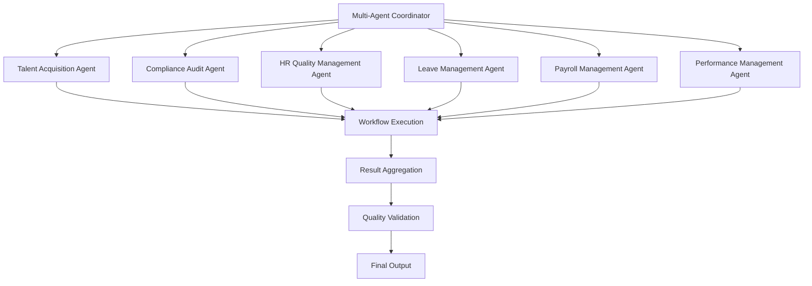

# Multi-Agent Coordinator — Orchestration and Workflow Management

## Overview

The Multi-Agent Coordinator serves as the central orchestration engine for complex HR workflows, managing the collaboration between multiple specialized AI agents. This agent ensures seamless coordination, conflict resolution, and optimal outcomes across interconnected HR processes.

## Core Capabilities

### Orchestration Functions
- **Workflow Management**: Coordinate multi-step processes across agents
- **Agent Communication**: Facilitate inter-agent messaging and data sharing
- **Conflict Resolution**: Resolve competing priorities and resource conflicts
- **Quality Assurance**: Ensure workflow completeness and accuracy
- **Performance Optimization**: Monitor and improve agent collaboration efficiency

### Coordination Features
- **Parallel Processing**: Execute independent tasks simultaneously
- **Sequential Dependencies**: Manage task dependencies and prerequisites
- **Conditional Branching**: Handle decision points and alternative paths
- **Error Handling**: Manage failures and implement recovery strategies
- **Progress Tracking**: Monitor workflow status and completion

## Agent Architecture



## Workflow Orchestration

### Workflow Types

#### 1. Sequential Workflows
**Pattern**: Agent A → Agent B → Agent C
**Example**: New Hire Onboarding
```yaml
sequence:
  - agent: talent-acquisition
    action: prepare_documents
    next: compliance-audit
  - agent: compliance-audit
    action: verify_compliance
    next: hr-quality-management
  - agent: hr-quality-management
    action: final_audit
```

#### 2. Parallel Workflows
**Pattern**: Agent A + Agent B + Agent C → Aggregation
**Example**: Performance Review Calibration
```yaml
parallel:
  - agent: performance-management
    action: individual_reviews
  - agent: hr-quality-management
    action: quality_checks
  - agent: compliance-audit
    action: compliance_verification
aggregation: calibration_session
```

#### 3. Conditional Workflows
**Pattern**: Decision Point → Branch A or Branch B
**Example**: Leave Request Processing
```yaml
conditional:
  condition: "leave_type == 'emergency'"
  true_branch:
    - agent: leave-management
      action: auto_approve
  false_branch:
    - agent: leave-management
      action: manager_approval
    - agent: compliance-audit
      action: verify_entitlement
```

### Workflow Templates

#### New Hire Onboarding Workflow
```yaml
workflow_template:
  name: "new-hire-onboarding"
  trigger: "job_offer_accepted"
  stages:
    - name: "pre_onboarding"
      agents: ["talent-acquisition"]
      actions: ["prepare_documents", "schedule_orientation"]
      timeout: "2_days"
    
    - name: "compliance_check"
      agents: ["compliance-audit"]
      actions: ["verify_eligibility", "check_contract"]
      timeout: "1_day"
    
    - name: "quality_assurance"
      agents: ["hr-quality-management"]
      actions: ["audit_process", "generate_report"]
      timeout: "4_hours"
```

#### Performance Management Workflow
```yaml
workflow_template:
  name: "performance-management"
  trigger: "review_cycle_start"
  stages:
    - name: "goal_setting"
      agents: ["performance-management"]
      actions: ["set_objectives", "create_plans"]
      parallel: true
    
    - name: "mid_cycle_review"
      agents: ["performance-management", "hr-quality-management"]
      actions: ["progress_review", "quality_check"]
      parallel: true
    
    - name: "annual_evaluation"
      agents: ["performance-management", "compliance-audit", "hr-quality-management"]
      actions: ["final_review", "compliance_audit", "calibration"]
      sequential: true
```

## Agent Communication Protocol

### Message Types

#### 1. Task Assignment
```typescript
interface TaskAssignment {
  workflowId: string;
  agentId: string;
  task: TaskDefinition;
  priority: Priority;
  deadline: Date;
  dependencies: string[];
}
```

#### 2. Status Update
```typescript
interface StatusUpdate {
  workflowId: string;
  taskId: string;
  status: TaskStatus;
  progress: number;
  result?: any;
  error?: ErrorDetails;
}
```

#### 3. Coordination Request
```typescript
interface CoordinationRequest {
  workflowId: string;
  requestType: CoordinationType;
  details: any;
  priority: Priority;
}
```

### Communication Patterns

#### Direct Communication
- **Point-to-Point**: Coordinator ↔ Individual Agent
- **Broadcast**: Coordinator → All Agents
- **Multicast**: Coordinator → Group of Agents

#### Event-Driven Communication
- **Event Subscription**: Agents subscribe to workflow events
- **Event Publishing**: Agents publish completion/status events
- **Event Processing**: Coordinator processes and routes events

## Conflict Resolution

### Conflict Types

#### 1. Resource Conflicts
**Scenario**: Multiple agents require same resource simultaneously
**Resolution**: Priority-based allocation, queuing, or parallel execution

#### 2. Data Conflicts
**Scenario**: Agents have conflicting data requirements
**Resolution**: Data validation, conflict detection, and resolution protocols

#### 3. Priority Conflicts
**Scenario**: Competing workflow priorities
**Resolution**: Priority escalation, resource reallocation, or sequencing

### Resolution Strategies

```yaml
conflict_resolution:
  resource_conflict:
    strategy: "priority_queue"
    criteria: ["deadline", "business_impact", "agent_priority"]
  
  data_conflict:
    strategy: "validation_first"
    process: ["validate_sources", "cross_reference", "consensus_building"]
  
  priority_conflict:
    strategy: "escalation_matrix"
    levels: ["agent_level", "workflow_level", "system_level"]
```

## Quality Assurance

### Quality Gates

#### 1. Input Validation
- **Data Completeness**: All required inputs present
- **Data Accuracy**: Input data meets quality standards
- **Data Consistency**: No conflicting information

#### 2. Process Validation
- **Task Completion**: All assigned tasks completed
- **Dependency Satisfaction**: Prerequisites met before execution
- **Timeline Compliance**: Tasks completed within deadlines

#### 3. Output Validation
- **Result Accuracy**: Outputs meet quality standards
- **Result Completeness**: All expected outputs produced
- **Result Consistency**: Outputs align with workflow requirements

### Quality Metrics

```yaml
quality_metrics:
  workflow_completion_rate: "Percentage of workflows completed successfully"
  average_workflow_duration: "Mean time from start to completion"
  error_rate: "Percentage of workflows with errors"
  agent_utilization: "Percentage of time agents are actively working"
  coordination_efficiency: "Ratio of coordination time to total workflow time"
```

## Performance Optimization

### Optimization Strategies

#### 1. Load Balancing
- **Agent Workload Distribution**: Balance tasks across available agents
- **Resource Allocation**: Optimize resource usage across workflows
- **Parallel Execution**: Maximize concurrent task execution

#### 2. Caching and Reuse
- **Result Caching**: Cache intermediate results for reuse
- **Template Reuse**: Reuse successful workflow patterns
- **Knowledge Transfer**: Share learnings across workflows

#### 3. Predictive Optimization
- **Workload Forecasting**: Predict future resource requirements
- **Performance Prediction**: Estimate workflow completion times
- **Bottleneck Identification**: Identify and resolve performance constraints

### Performance Monitoring

```yaml
performance_indicators:
  throughput: "Number of workflows completed per hour"
  latency: "Average time from request to completion"
  utilization: "Percentage of agent capacity used"
  error_rate: "Percentage of failed workflows"
  scalability: "Ability to handle increased load"
```

## Integration Interfaces

### Workflow API

```typescript
interface WorkflowCoordinator {
  // Workflow management
  createWorkflow(template: WorkflowTemplate): Promise<WorkflowInstance>
  executeWorkflow(workflowId: string): Promise<WorkflowResult>
  monitorWorkflow(workflowId: string): Promise<WorkflowStatus>
  cancelWorkflow(workflowId: string): Promise<void>
  
  // Agent management
  registerAgent(agent: AgentDefinition): Promise<AgentRegistration>
  getAgentStatus(agentId: string): Promise<AgentStatus>
  updateAgentCapabilities(agentId: string, capabilities: Capability[]): Promise<void>
  
  // Coordination
  coordinateAgents(workflowId: string, coordination: CoordinationRequest): Promise<CoordinationResult>
  resolveConflict(workflowId: string, conflict: ConflictDetails): Promise<ResolutionResult>
  
  // Analytics
  getWorkflowMetrics(workflowId: string): Promise<WorkflowMetrics>
  getSystemAnalytics(): Promise<SystemAnalytics>
}
```

### Agent Interface

```typescript
interface AgentInterface {
  // Task execution
  executeTask(task: TaskDefinition): Promise<TaskResult>
  getTaskStatus(taskId: string): Promise<TaskStatus>
  cancelTask(taskId: string): Promise<void>
  
  // Communication
  sendMessage(message: AgentMessage): Promise<void>
  receiveMessage(): Promise<AgentMessage>
  subscribeToEvents(events: EventType[]): Promise<SubscriptionResult>
  
  // Coordination
  requestCoordination(request: CoordinationRequest): Promise<CoordinationResult>
  reportStatus(status: AgentStatus): Promise<void>
  
  // Capabilities
  getCapabilities(): Promise<Capability[]>
  updateCapabilities(capabilities: Capability[]): Promise<void>
}
```

## Configuration Management

### Coordinator Configuration

```yaml
coordinator_config:
  version: "1.0.0"
  max_concurrent_workflows: 50
  agent_timeout: "30_minutes"
  retry_attempts: 3
  escalation_threshold: "15_minutes"
  
  agent_priorities:
    compliance-audit: "high"
    hr-quality-management: "high"
    talent-acquisition: "medium"
    leave-management: "medium"
    payroll-management: "high"
    performance-management: "medium"
  
  workflow_priorities:
    emergency_leave: "critical"
    payroll_processing: "high"
    new_hire_onboarding: "high"
    performance_reviews: "medium"
    compliance_audits: "high"
```

## Monitoring & Analytics

### Real-Time Dashboard

- **Active Workflows**: Current running workflows and status
- **Agent Utilization**: Agent workload and availability
- **Queue Status**: Pending workflows and queue lengths
- **Performance Metrics**: Throughput, latency, and error rates

### Analytics Reports

- **Workflow Performance**: Completion rates and durations
- **Agent Efficiency**: Task completion and error rates
- **System Utilization**: Resource usage and bottlenecks
- **Quality Metrics**: Error rates and resolution times

## Future Enhancements

### Phase 2 (Q2 2026)
- **Machine Learning Optimization**: AI-driven workflow optimization
- **Dynamic Scaling**: Automatic agent scaling based on load
- **Predictive Coordination**: Anticipate and prevent conflicts
- **Advanced Analytics**: Deep workflow performance insights

### Phase 3 (Q3 2026)
- **Self-Optimizing Systems**: Autonomous performance improvement
- **Multi-System Orchestration**: Coordinate across different platforms
- **Cognitive Coordination**: Advanced decision-making capabilities
- **Blockchain Coordination**: Immutable workflow audit trails

## Conclusion

The Multi-Agent Coordinator represents the pinnacle of AI orchestration for HR management, enabling complex, multi-agent workflows that deliver superior outcomes through intelligent coordination, conflict resolution, and continuous optimization. This agent serves as the central nervous system for the entire AI agent ecosystem, ensuring that all specialized agents work together harmoniously to achieve organizational objectives while maintaining compliance and quality standards.
