# MyQMS Enterprise Platform
## AI-Native Integrated Management System (IMS)
### Governance • Risk • Quality • Compliance • Automation • Intelligence

---

[](https://nextjs.org)
[](https://react.dev)
[](https://www.typescriptlang.org)
[](https://trpc.io)
[](https://tailwindcss.com)
[](#)
[](LICENSE)

---

# Table of Contents

1. [Executive Summary](#1-executive-summary)
2. [Strategic Vision](#2-strategic-vision)
3. [Business Outcomes](#3-business-outcomes)
4. [Platform Capabilities](#4-platform-capabilities)
5. [Enterprise Architecture](#5-enterprise-architecture)
6. [System Context Diagram](#6-system-context-diagram)
7. [Business Capability Map](#7-business-capability-map)
8. [AI Operating Model](#8-ai-operating-model)
9. [Service Architecture](#9-service-architecture)
10. [Platform Data Flow](#10-platform-data-flow)
11. [Deployment Architecture](#11-deployment-architecture)
12. [Security & Governance](#12-security--governance)
13. [Technology Stack](#13-technology-stack)
14. [Operating Model](#14-operating-model)
15. [KPI Framework](#15-kpi-framework)
16. [Delivery Roadmap](#16-delivery-roadmap)
17. [Contribution Model](#17-contribution-model)
18. [License & Support](#18-license--support)

---

## 1. Executive Summary

MyQMS is an enterprise-scale AI-powered Integrated Management System (IMS) that unifies governance, quality management, compliance automation, process orchestration, risk management, and operational intelligence into a single, coherent platform.

Traditional quality and compliance systems operate in silos, creating redundant work, delayed audits, and missed risks. MyQMS breaks these barriers by embedding AI agents that observe, analyze, recommend, and execute actions across the entire management system landscape.

**Core outcomes delivered:**

- **Reduce compliance effort** – up to 70% reduction in manual documentation and evidence gathering
- **Accelerate audit readiness** – real-time continuous compliance posture with one-click audit trails
- **Improve decision quality** – AI-synthesized risk and quality insights at executive and operational levels
- **Standardize execution** – unified workflows for CAPA, change control, document management, and risk assessment
- **Enable intelligent automation** – rule-based and self-learning agents that trigger corrective actions
- **Build organizational resilience** – proactive risk detection and adaptive control frameworks

---

## 2. Strategic Vision

> **Transform governance and compliance from administrative overhead into strategic business intelligence.**

By 2027, MyQMS will power autonomous quality ecosystems where:

- Audit evidence is generated in real time from live operational data
- Risks are predicted before they materialize
- Compliance becomes a byproduct of normal work, not a separate activity
- AI agents negotiate control effectiveness across supply chains
- Boards receive forward-looking compliance and risk intelligence, not historical reports

---

## 3. Business Outcomes

| Objective | Impact | Measurement |
|-----------|--------|--------------|
| **Audit Efficiency** | 70% less preparation time | Hours per audit |
| **Compliance Readiness** | 90% faster certification cycles | Days to ISO/regulatory approval |
| **Knowledge Retention** | 100% capture of institutional decisions | Retention rate of AI memory |
| **Risk Visibility** | 80% earlier intervention | Weeks from risk emergence to mitigation |
| **Process Excellence** | 95% standardized execution | Workflow adherence rate |
| **AI Adoption** | 60% operational acceleration | Tasks automated vs. manual |

---

## 4. Platform Capabilities

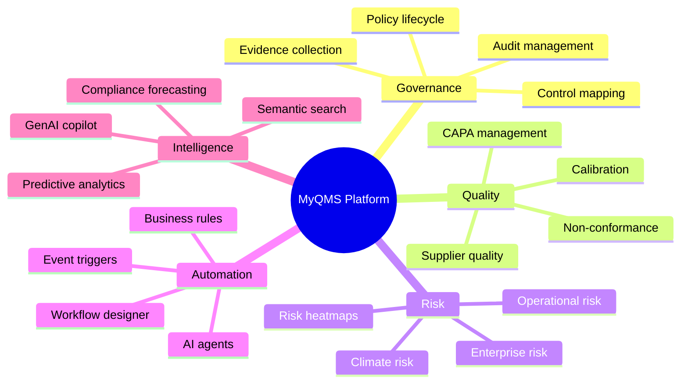

**Detailed capability breakdown:**

- **Governance** – central policy repository, automated control testing, audit schedule optimization, real-time evidence locker
- **Quality** – 8D/CAPA workflows, root cause analysis with AI suggestions, quality review dashboards, supplier scorecards
- **Risk** – bowtie analysis, risk appetite tracking, KRIs, climate scenario modeling, risk treatment plans
- **Automation** – drag-and-drop workflow builder, no-code agent creation, IF-THEN rules, API-triggered actions
- **Intelligence** – natural language querying over all QMS data, anomaly detection, trend forecasting, recommendation engine

---

## 5. Enterprise Architecture

### Architecture Principles

| Principle | Description |
|-----------|-------------|
| **AI-Native** | LLMs and predictive models are core services, not add-ons |
| **Cloud-Optimized** | Runs on any cloud (AWS, Azure, GCP) with auto-scaling |
| **Modular** | Deploy Governance, Quality, Risk as separate or combined units |
| **Type-Safe** | Entire stack uses TypeScript + Zod; runtime validation end-to-end |
| **Secure by Design** | Zero-trust, encrypt-at-rest/in-transit, signed audit logs |
| **Observable** | OpenTelemetry standard, traces every decision and action |

### High-Level Architecture Layers

1. **Experience Layer** – Next.js 16 App Router, React Server Components, Tailwind 4
2. **API Gateway Layer** – tRPC v11 with Zod validation, rate limiting, JWT auth
3. **Orchestration Layer** – Temporal workflows + AI agent swarm
4. **Domain Services** – Compliance, Document, Audit, Risk, Quality (separate bounded contexts)
5. **Intelligence Layer** – Vector DB (pgvector), LLM router (GPT-4o, Claude, Llama 3), embedding cache
6. **Data & Storage** – PostgreSQL (primary), S3-compatible (blobs), Redis (session/cache)

---

## 6. System Context Diagram

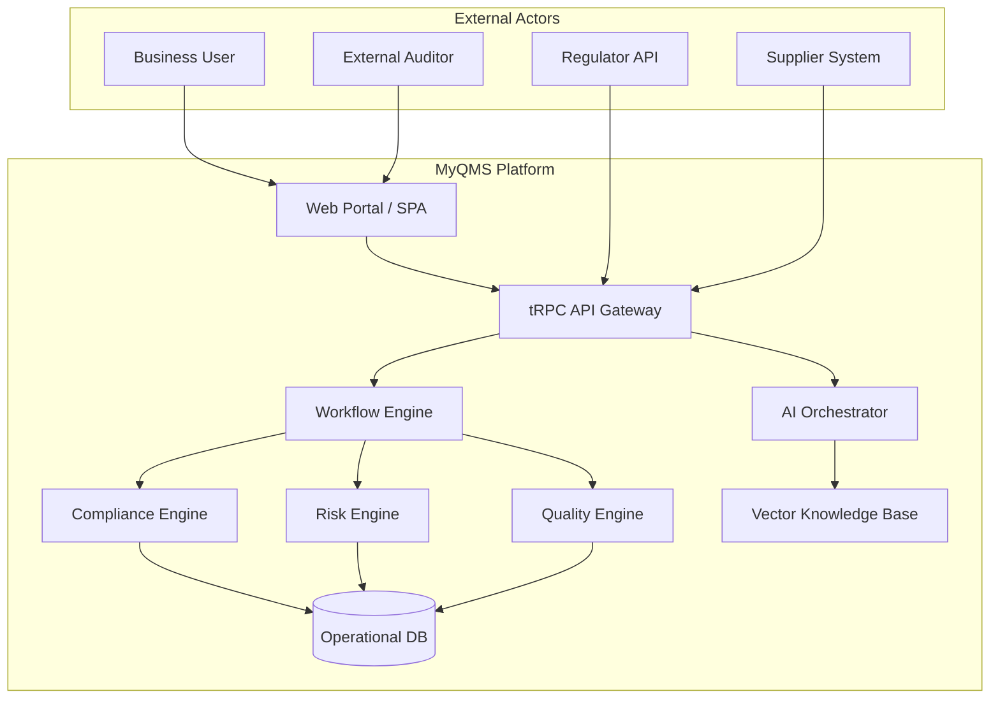

**External integrations:**
- ERP systems (SAP, Oracle, NetSuite)
- GRC platforms (Archer, ServiceNow)
- Monitoring tools (Datadog, Prometheus)
- Identity providers (Okta, Azure AD, Ping)

---

## 7. Business Capability Map

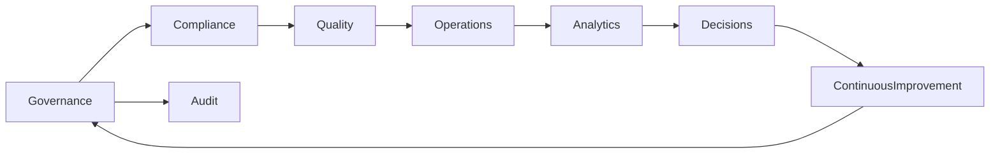

**Capability heatmap:**

| Level 1 | Level 2 | Level 3 | Maturity |
|---------|---------|---------|----------|
| Governance | Policy Mgmt | Policy Authoring | Optimizing |
| Governance | Control Mgmt | Control Testing | Automated |
| Compliance | Regulatory | Obligation Mapping | Intelligent |
| Quality | CAPA | Root Cause Analysis | AI-assisted |
| Risk | Assessment | Scenario Analysis | Predictive |
| Operations | Workflow | Process Mining | Autonomous |

---

## 8. AI Operating Model

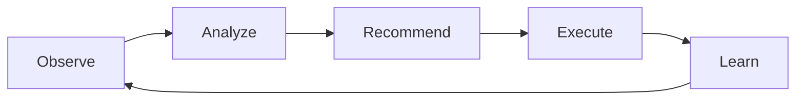

### AI Lifecycle Stages

| Stage | Description | MyQMS Implementation |
|-------|-------------|----------------------|
| **Observe** | Collect signals from workflows, documents, IoT, APIs | Event bridge captures every transaction, document change, audit result |
| **Analyze** | Evaluate context, detect anomalies, classify risk | Real-time embedding + LLM classification; anomaly detection models |
| **Recommend** | Generate decision options with confidence scores | GenAI produces corrective action proposals, control improvements |
| **Execute** | Trigger workflows, send alerts, update systems | Agent invokes API calls, creates CAPA, adjusts risk scores |
| **Learn** | Store outcomes, improve models, update knowledge base | Human feedback loop + reinforcement learning from audit results |

### Agent Types

- **Compliance Agent** – continuously maps controls to evidence, flags gaps
- **CAPA Agent** – suggests root causes, assigns owners, tracks effectiveness
- **Risk Agent** – monitors KRIs, runs Monte Carlo simulations
- **Audit Agent** – prepares workpapers, generates checklist responses
- **Supplier Agent** – evaluates supplier quality data, predicts non-conformance

---

## 9. Service Architecture

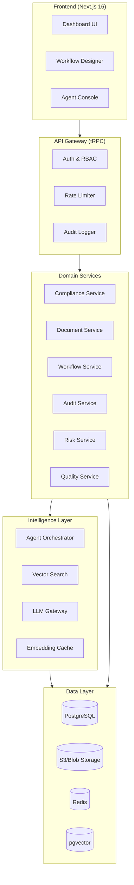

**Service communication:**  
- Synchronous: gRPC (internal) / tRPC (external)  
- Asynchronous: Kafka / Redis Streams  
- Workflow orchestration: Temporal  

---

## 10. Platform Data Flow

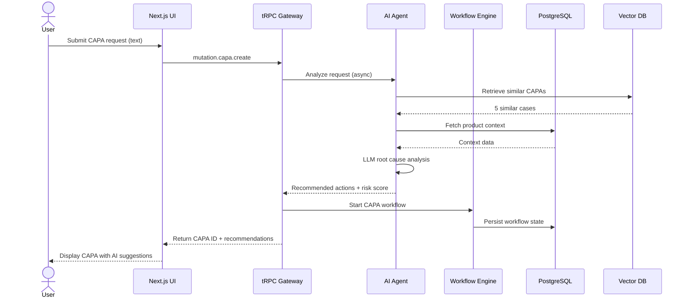

**Data classification:**
- **Critical** – audit trails, signed documents (immutable, encrypted)
- **Confidential** – risk assessments, supplier data (row-level security)
- **Internal** – workflows, tasks (standard access controls)
- **Public** – policies (read-only for all authenticated)

---

## 11. Deployment Architecture

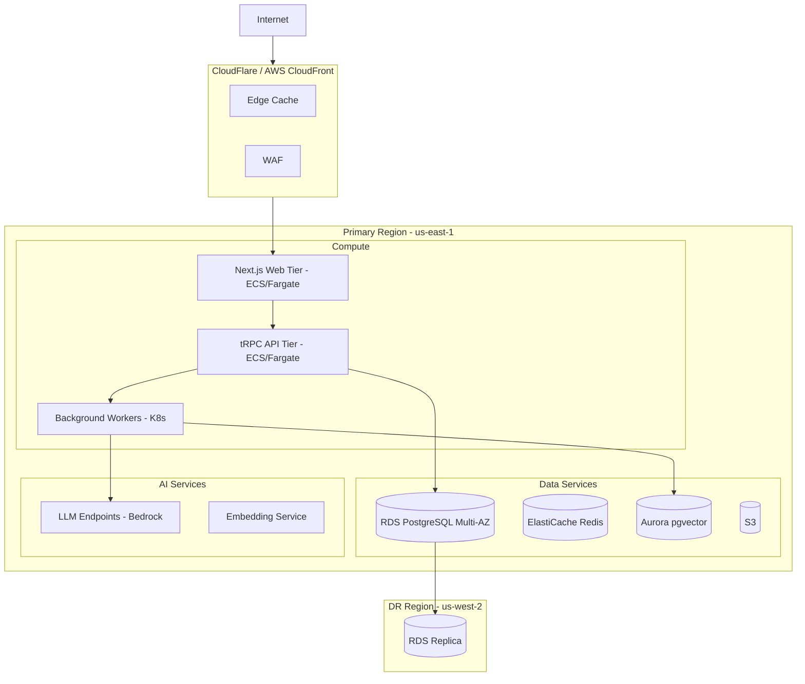

**Scalability & resilience:**
- Auto-scaling: 3–50 instances based on CPU/memory/queue depth
- RPO: 5 minutes (point-in-time recovery)
- RTO: 15 minutes (cross-region failover)
- Multi-tenancy: Siloed database schemas + row-level security

---

## 12. Security & Governance

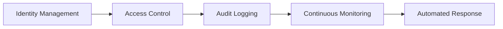

### Security Controls Matrix

| Domain | Control | Implementation |
|--------|---------|----------------|
| **Identity** | MFA, SSO | Okta/Azure AD, enforced for all users |
| **Access** | RBAC + ABAC | Fine-grained roles (admin, auditor, manager, editor, viewer) |
| **Data** | Encryption at rest | AES-256 (RDS, S3) |
| **Data** | Encryption in transit | TLS 1.3 only |
| **Audit** | Immutable audit log | Blockchain hash chain of all events |
| **Secrets** | No hardcoded secrets | AWS Secrets Manager + automatic rotation |
| **API** | Rate limiting, JWT | 1000 req/min per tenant, short-lived tokens |
| **Segmentation** | VPC / private subnets | No public database access |

### Compliance Certifications

- SOC 2 Type II
- ISO 27001, 9001, 14001
- GDPR / CCPA ready
- FDA 21 CFR Part 11 (validation pack)

---

## 13. Technology Stack

| Layer | Technology | Version | Justification |
|-------|------------|---------|----------------|
| **Frontend framework** | Next.js | 16 | App Router, RSC, optimized builds |
| **UI library** | React | 19 | Concurrent features, Server Components |
| **Styling** | Tailwind CSS | 4 | Utility-first, dark mode, theming |
| **API layer** | tRPC | 11 | End-to-end typesafety, no codegen |
| **Validation** | Zod | 3 | Runtime type validation |
| **Language** | TypeScript | 5.9 | Strict mode, full type coverage |
| **AI orchestration** | LangChain + custom agents | 0.3 | Multi-model support, tool calling |
| **Vector database** | pgvector | 0.7 | Extension of PostgreSQL |
| **Primary database** | PostgreSQL | 16 | ACID, JSONB, full-text search |
| **Workflow engine** | Temporal | 1.23 | Durable execution, replayability |
| **Message queue** | Redis Streams | 7.4 | Low latency, exactly-once semantics |
| **Infrastructure** | Terraform / AWS CDK | – | Infrastructure as Code |
| **Observability** | OpenTelemetry + Datadog | – | Traces, metrics, logs unified |

---

## 14. Operating Model

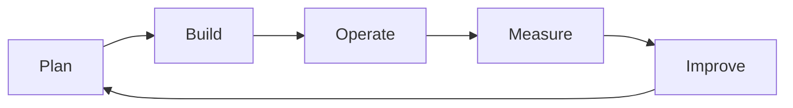

### Roles & Responsibilities

| Role | Responsibilities |
|------|------------------|
| **Product Owner** | Backlog prioritization, outcome validation |
| **Platform Architect** | Cross-cutting concerns, AI integration |
| **DevOps Engineer** | CI/CD, deployment, SLOs |
| **Security Champion** | Threat modeling, pen testing |
| **Quality Engineer** | Automated testing, test data |
| **Support Engineer** | L2/L3 incident response |

### Operational Cadence

- **Daily**: Standup, AI model drift check
- **Weekly**: Security scan, performance review
- **Monthly**: Incident post-mortem, capacity planning
- **Quarterly**: Compliance audit, disaster recovery drill
- **Yearly**: Stack upgrade, certification renewal

---

## 15. KPI Framework

| Area | KPI | Target | Measurement |
|------|-----|--------|--------------|
| **Compliance** | Audit completion time | < 5 days | Platform metric |
| **Quality** | CAPA closure rate | 95% within SLA | Workflow analytics |
| **Operations** | Process cycle time reduction | -40% YoY | Process mining |
| **Risk** | Risk mitigation lead time | < 10 days | Risk engine |
| **AI** | Recommendation adoption rate | > 70% | Agent analytics |
| **Platform** | Uptime (SLA) | 99.95% | Uptime monitoring |
| **Platform** | API p95 latency | < 200 ms | APM |

### Dashboard Example

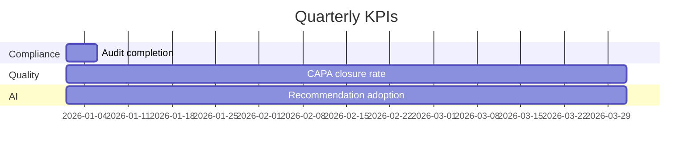

---

## 16. Delivery Roadmap

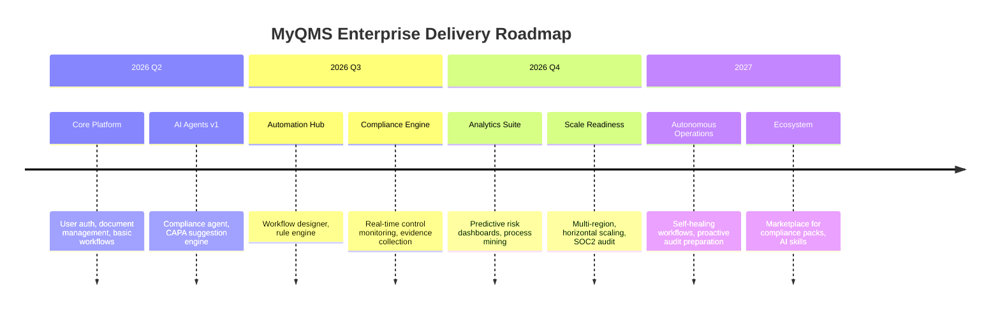

### Milestones & Dependencies

| Milestone | Date | Dependencies | Success Criterion |
|-----------|------|--------------|-------------------|
| MVP launch | 2026-04-15 | Core services | 5 pilot customers |
| AI agent GA | 2026-06-30 | LLM gateway | >50% adoption in pilot |
| SOC2 Type II | 2026-12-15 | All controls | Zero major findings |
| ISO 27001 | 2027-03-30 | SOC2 + documentation | Certification issued |

---

## 17. Contribution Model

We welcome contributions from enterprise partners, integration vendors, and open-source community under the **MIT License**.

### Contribution Must Align With:

- **Architecture standards** – must follow layered architecture, use tRPC for APIs, Zod for validation
- **Security requirements** – no hardcoded secrets, pass SAST/DAST scans, encrypted at rest
- **Documentation policies** – every new feature requires README update and OpenAPI spec
- **Testing coverage** – unit ≥80%, integration ≥70%, E2E for critical paths
- **Enterprise release process** – feature flagged, backward compatible, migration scripts provided

### How to Contribute

1. **Internal (employees/partners)**:  
   - Fork from `main`, create feature branch, open PR with template  
   - Mandatory reviews: security + domain expert  
   - Merge via squash after CI passes (lint, test, build, security scan)

2. **External (open-source)**:  
   - Issue triage → assign `good-first-issue`  
   - Sign CLA (Contributor License Agreement)  
   - PR review within 5 business days

### Development Setup

```bash
git clone https://github.com/myqms/platform
cd platform
pnpm install
cp .env.example .env
docker compose up -d
pnpm run dev
```

---

## 18. License & Support

### License

- **Core Platform**: MIT License – free for self-hosted, unlimited users
- **Enterprise Modules** (Advanced AI, Compliance Packs, SLA Support): Commercial license
- **Documentation**: CC BY-SA 4.0

### Deployment Models

| Model | Description | Typical Use Case |
|-------|-------------|------------------|
| **SaaS** | Fully managed, monthly subscription | Mid-market, rapid adoption |
| **Private Cloud** | Deployed in customer's cloud (AWS/Azure/GCP) | Regulated industries |
| **Hybrid** | SaaS core + on-prem data connectors | Data residency needs |
| **Air-Gapped** | Fully offline, self-contained | Defense, critical infra |

### Support Offerings

| Tier | Hours | Response SLA | Included |
|------|-------|--------------|----------|
| **Community** | Best effort | – | GitHub issues |
| **Standard** | 9x5 local time | 4 hours critical | Email + portal |
| **Premium** | 24x7 | 1 hour critical | Phone + dedicated Slack |
| **Enterprise** | 24x7 with TAM | 15 minutes critical | Custom SLA, on-site architect |

### Support Channels

- **Documentation**: [docs.myqms.xyz](https://docs.myqms.xyz)
- **Status Page**: [status.myqms.xyz](https://status.myqms.xyz)
- **Email**: [support@myqms.xyz](support@myqms.xyz)
- **Emergency**: +60 MYQMS-01

---

# Closing Statement

**MyQMS transforms compliance, governance, and operational execution into a continuous intelligence platform.**  
*Audit-ready every second. Risk-aware by design. Quality without friction.*

---

*© 2026 MyQMS Enterprise. All rights reserved.  
Document version: 2.3.0 | Last updated: 2026-07-03*
