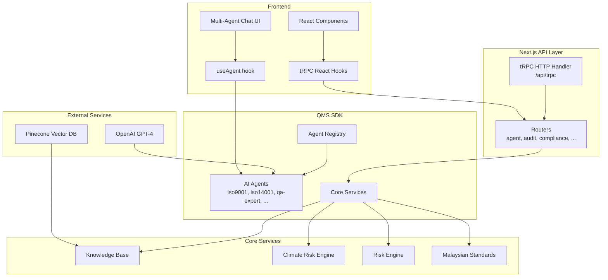
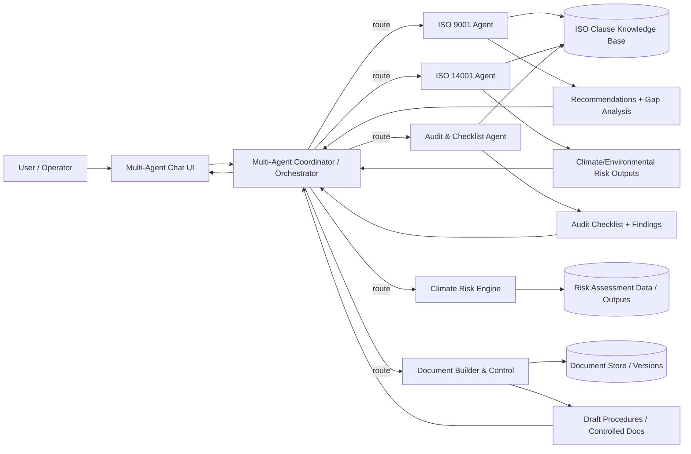

# MyQMS | Malaysian Quality Management System

## Scalable Enterprise AI Platform

> **Automate workflows**, **accelerate inference,** and **generate real-time insights.**
Deploy globally with built-in security, governance, and compliance.


> Repository status: **Active**
> Multi-agent orchestration, ISO compliance checking, audit automation, process flow designer, and document management.
> Mermaid diagrams are included below for quick architecture scanning.

---

## ✨ Features

| Capability | Description |
|------------|-------------|
| **Multi-Agent AI System** | 10+ specialized agents (Quality Manager, QA Expert, Manufacturing, Construction, Insurance, ISO specialists) |
| **ISO Knowledge Base** | Pre-loaded clauses for ISO 9001, 14001, 45001, 17025, 17020, 27001 |
| **Conversational AI** | Natural language chat with specialized agents via multi-agent interface |
| **Compliance Checking** | Real-time ISO compliance assessment with scoring and gap analysis |
| **Audit Automation** | Generate audit checklists, conduct internal audits, track findings |
| **Climate Risk Engine** | ISO 14001 AMD.1:2024 climate change adaptation and risk assessment |
| **Process Flow Designer** | Visual workflow and process mapping with xyflow |
| **Document Management** | Document control, version management, and builder |
| **Type-Safe APIs** | Full tRPC integration with React Query |
| **Modern UI** | Radix UI components with Tailwind CSS and Framer Motion |

---

## 🏗️ Architecture

The QMS platform uses a modular architecture with Next.js App Router, tRPC for type-safe APIs, and a multi-agent AI system:



### Claude-style Multi-Agent Orchestration (Updated)



---

## 📁 Project Structure

```
qms/
├── app/                           # Next.js 16 App Router
│   ├── agents/                    # Multi-agent chat interface
│   ├── compliance/                # ISO compliance checking
│   ├── documents/                 # Document management
│   ├── flow-process/              # Process flow designer
│   ├── generator/                 # QMS document generator
│   ├── processes/                 # Process management
│   ├── projects/                  # Project tracking
│   └── api/trpc/[trpc]/          # tRPC API handler
├── components/
│   ├── ai/                        # AI-powered components
│   ├── ai-elements/               # Reusable AI UI elements
│   ├── automation/                # Workflow automation (xyflow)
│   ├── dashboard/                 # Dashboard widgets
│   ├── qms/                       # QMS-specific components
│   │   ├── multi-agent-chat.tsx
│   │   ├── ISOComplianceChecker.tsx
│   │   ├── processflow_designer.tsx
│   │   └── ...
│   └── ui/                        # Radix UI components
├── sdk/
│   ├── agents/                    # AI agent definitions
│   │   ├── iso9001-agent.ts
│   │   ├── iso14001-agent.ts
│   │   ├── iso45001-agent.ts
│   │   ├── quality-manager.ts
│   │   ├── qa-expert.ts
│   │   ├── manufacturing-expert.ts
│   │   ├── construction-expert.ts
│   │   ├── insurance-expert.ts
│   │   └── ims-integrator-agent.ts
│   ├── knowledge-base/            # ISO clause databases
│   │   ├── iso9001-clauses.json
│   │   ├── iso14001-clauses.json
│   │   ├── iso45001-clauses.json
│   │   ├── iso17025:2017-clauses.json
│   │   ├── iso17020-clauses.json
│   │   └── iso27001-clauses.json
│   ├── services/
│   │   ├── climate-risk-engine.ts
│   │   ├── risk-engine.ts
│   │   └── malaysian-standards.ts
│   ├── server/                    # tRPC routers
│   │   ├── router.ts
│   │   ├── ms-router.ts
│   │   ├── manufacturing-router.ts
│   │   ├── construction-router.ts
│   │   ├── insurance-router.ts
│   │   └── testing-router.ts
│   ├── client/                    # tRPC client & hooks
│   │   ├── trpc.ts
│   │   ├── hooks.ts
│   │   └── provider.tsx
│   ├── core/
│   │   ├── registry.ts            # Agent registry
│   │   ├── orchestrator.ts
│   │   └── vector-service.ts
│   └── prisma/
│       └── schema.prisma          # Database schema
├── lib/
│   ├── types.ts
│   ├── utils.ts
│   └── mock-data.ts
└── public/                        # Static assets
```

---

## 🧩 Architecture

### Multi-Agent System
Agents are defined in `sdk/agents/` with specialized capabilities:

```ts
// sdk/agents/iso9001-agent.ts
export const iso9001Agent: AgentConfig = {
  id: 'iso9001-agent',
  role: AgentRole.QUALITY_MANAGER,
  name: 'ISO 9001 Quality Manager',
  capabilities: [
    'ISO 9001:2015 QMS Implementation',
    'Quality Policy & Objectives',
    'Risk-Based Thinking',
    'Internal Audit Facilitation',
    // ...
  ],
  tools: [
    { name: 'assess_qms_compliance', /* ... */ },
    { name: 'generate_audit_checklist', /* ... */ },
    { name: 'conduct_risk_assessment', /* ... */ },
  ],
};
```

Agents are registered in `sdk/core/registry.ts` and accessible via the multi-agent chat UI.

### tRPC API Layer
Type-safe APIs with full TypeScript inference:

```ts
// sdk/server/router.ts
export const appRouter = router({
  agent: agentRouter,
  document: documentRouter,
  process: processRouter,
  compliance: complianceRouter,
  audit: auditRouter,
  testing: testingRouter,
  manufacturing: manufacturingRouter,
  construction: constructionRouter,
  insurance: insuranceRouter,
  ms: msRouter,
});
```

### React Hooks
Client-side hooks with React Query integration:

```tsx
import { trpc } from '@/sdk/client/trpc';
import { useAgent, useAgentList } from '@/sdk/client/hooks';

function MyComponent() {
  const { data: agents } = useAgentList();
  const { agent, messages, sendMessage } = useAgent('iso9001-agent');
  const mutation = trpc.audit.generateChecklist.useMutation();
}
```

### UI Components
Reusable components built with Radix UI and Tailwind CSS:
- `<MultiAgentChat />` - Multi-agent conversation interface
- `<ISOComplianceChecker />` - ISO compliance assessment
- `<ProcessFlowDesigner />` - Visual process mapping
- `<DocumentBuilder />` - Document creation and management

---

## 🚀 Getting Started

### Prerequisites

- Node.js 20+
- npm, pnpm, or yarn
- OpenAI API key (for AI agents)
- Pinecone API key (optional, for vector search)
- PostgreSQL database (optional, for Prisma)

### Installation

1. **Clone the repository**
   ```bash
   git clone https://github.com/your-org/qms.git
   cd qms
   ```

2. **Install dependencies**
   ```bash
   npm install
   # or
   pnpm install
   ```

3. **Set environment variables**
   Create `.env.local`:
   ```env
   OPENAI_API_KEY=sk-...
   PINECONE_API_KEY=your-key
   PINECONE_INDEX_NAME=qms-compliance
   
   # Ollama Cloud (Optional - for running models without GPU)
   OLLAMA_API_KEY=your-ollama-cloud-api-key
   OLLAMA_HOST=http://localhost:11434
   OLLAMA_CLOUD_HOST=https://ollama.com/api
   
   DATABASE_URL=postgresql://...
   ```

4. **Setup database** (optional)
   ```bash
   npx prisma generate
   npx prisma db push
   ```

5. **Start development server**
   ```bash
   npm run dev
   ```
   Visit `http://localhost:3000`

---

## ☁️ Ollama Cloud Setup

Ollama Cloud allows you to run large language models without a local GPU. The QMS platform includes built-in support for Ollama Cloud models.

### 1. Get Ollama Cloud API Key

1. Visit [ollama.com](https://ollama.com)
2. Sign up or log in
3. Go to [Settings → Keys](https://ollama.com/settings/keys)
4. Create a new API key
5. Copy the key to your `.env.local`:
   ```env
   OLLAMA_API_KEY=your-api-key-here
   ```

### 2. Available Ollama Cloud Models

The QMS platform supports these Ollama Cloud models:

| Model | Size | Context | Best For |
|-------|------|---------|----------|
| **GPT-OSS 120B** | 120B parameters | 128K tokens | Complex reasoning, long documents |
| **GPT-OSS 20B** | 20B parameters | 128K tokens | Balanced performance, ISO compliance |
| **MiniMax M2.5 Cloud** | - | 100K tokens | General QMS assistance, chat |

### 3. Use Ollama Cloud in QMS

The models are automatically available in:
- **AI Panel** (Flow Process editor)
- **Chat Interface** (Agent selection)
- **AI-Powered Features** (Compliance checks, document generation)

Select "GPT-OSS 120B (Ollama Cloud)" from the model dropdown to use Ollama Cloud.

### 4. Model Selection Examples

In code:
```typescript
// Chat with Ollama Cloud
const messages = [{ role: 'user', content: 'What is ISO 9001?' }];
const result = await aiService.generateTextRouted(
  'What is ISO 9001?',
  { model: 'ollama/gpt-oss:120b' }
);

// Or use the hook
const { messages, input, handleSubmit } = useAI({
  model: 'ollama/gpt-oss:20b',
});
```

### 5. Pricing & Limits

- Ollama Cloud runs models on their infrastructure
- Pricing varies by model size and token usage
- See [ollama.com/pricing](https://ollama.com/pricing)
- Get free credits with new accounts

### 6. Troubleshooting

**Error: "Ollama Cloud API key not configured"**
- Ensure `OLLAMA_API_KEY` is set in `.env.local`
- Restart the development server: `npm run dev`

**Error: "API error 401"**
- API key is invalid or expired
- Generate a new key at [ollama.com/settings/keys](https://ollama.com/settings/keys)

**Model not responding**
- Check Ollama Cloud status at [status.ollama.com](https://status.ollama.com)
- Verify your account has available quota

---

## 💬 Usage Examples

### Multi-Agent Chat

Navigate to `/agents` to access the multi-agent interface:

```tsx
import { MultiAgentChat } from '@/components/qms/multi-agent-chat';

export default function AgentsPage() {
  return <MultiAgentChat />;
}
```

Select an agent (ISO 9001, QA Expert, Manufacturing, etc.) and chat:
- "Generate an audit checklist for ISO 9001 clause 8"
- "Assess our QMS compliance status"
- "What are the requirements for management review?"

### ISO Compliance Checking

```tsx
import { ISOComplianceChecker } from '@/components/qms/ISOComplianceChecker';

function CompliancePage() {
  return (
    <ISOComplianceChecker
      onCheckCompliance={() => console.log('Checking...')}
    />
  );
}
```

### Using Agent Tools

```tsx
import { useAgent } from '@/sdk/client/hooks';

function AuditGenerator() {
  const { agent, sendMessage } = useAgent('iso9001-agent');
  
  const generateChecklist = async () => {
    await sendMessage('Generate audit checklist for clause 9.2');
  };
}
```

### Climate Risk Assessment

```tsx
import { climateRiskEngine } from '@/sdk/services/climate-risk-engine';

const risk = climateRiskEngine.addRisk('CH-001', {
  likelihood: 'likely',
  severity: 'high',
  owner: 'Environmental Manager',
});

const summary = climateRiskEngine.getRiskSummary();
const plan = climateRiskEngine.generateClimateAdaptationPlan();
```

---

## 🔌 tRPC API Reference

All endpoints are fully type-safe:

### Agent Operations
| Procedure | Input | Output |
|-----------|-------|--------|
| `agent.list` | - | `Agent[]` |
| `agent.get` | `{ id: string }` | `Agent` |
| `agent.chat` | `{ agentId, message, sessionId? }` | `{ userMessage, agentResponse }` |
| `agent.executeTool` | `{ agentId, toolId, parameters }` | `{ executionId, result }` |

### Document Management
| Procedure | Input | Output |
|-----------|-------|--------|
| `document.list` | `{ type?, status?, tags? }` | `Document[]` |
| `document.create` | `{ title, content, type, version, status, tags }` | `Document` |
| `document.update` | `{ id, data }` | `Document` |
| `document.validate` | `{ id }` | `{ valid, issues }` |

### Compliance & Audit
| Procedure | Input | Output |
|-----------|-------|--------|
| `compliance.check` | `{ standard, requirements }` | `ComplianceResult[]` |
| `compliance.getReport` | `{ standard }` | `ComplianceReport` |
| `audit.generateChecklist` | `{ auditType, scope }` | `AuditChecklist` |
| `audit.create` | `{ ... }` | `Audit` |

### Industry-Specific
| Procedure | Input | Output |
|-----------|-------|--------|
| `manufacturing.recordMetrics` | `{ availability, performance, quality, ... }` | `Metrics` |
| `manufacturing.getOEE` | `{ startDate, endDate }` | `OEE` |
| `construction.createProject` | `{ name, description, budget, ... }` | `Project` |
| `insurance.generateQuote` | `{ policyType, coverage, riskFactors }` | `Quote` |

---

## 🤖 Available AI Agents

### ISO & IMS Standards Agents
- **ISO 9001 Agent** — QMS implementation, risk-based thinking, internal audit support
- **ISO 14001 Agent** — Environmental Management + **Climate Risk Engine** (AMD.1:2024)
- **ISO 45001 Agent** — Occupational Health & Safety
- **IMS Integrator** — Integrated Management Systems across multiple standards

### Operational & Domain Experts
- **Quality Manager** — ISO 13485, QMS implementation, quality policy & objectives
- **QA Expert** — Test strategy, quality processes, defect prevention
- **Manufacturing Expert** — MES, Industry 4.0, OEE and operational performance
- **Construction Expert** — Project management, BIM, safety integration
- **Insurance Expert** — Underwriting, claims support, actuarial-style risk reasoning
- **Documentation Manager** — Document control, versioning, controlled templates

### Claude Ecosystem Alignment (Repository Update)
This repository also maintains a **Claude System Index** and an April 2026 **Skills Matrix** under `claude/` to keep agent capability coverage, skills, and knowledge bases consistent across:
- Malaysian compliance / standards references
- Orchestrator routing and tool-calling
- AI UI component compatibility
- Agent capability mapping and updates

(Reference: `claude/README.md` and `claude/agents/skills/SKILL_MATRIX.md`)

Each agent has specialized tools and knowledge for their domain.


---

## 📦 Tech Stack

| Technology | Purpose |
|-----------|----------|
| **Next.js 16** | React framework with App Router |
| **React 19** | UI library |
| **TypeScript 5.9** | Type safety |
| **tRPC 11** | Type-safe APIs |
| **AI SDK** | AI agent framework (Vercel AI SDK) |
| **Radix UI** | Accessible component primitives |
| **Tailwind CSS 4** | Utility-first styling |
| **Framer Motion** | Animations |
| **xyflow** | Process flow diagrams |
| **Recharts** | Data visualization |
| **Zod** | Schema validation |
| **Prisma** | Database ORM |
| **Pinecone** | Vector database (optional) |
| **React Query** | Data fetching & caching |

---

## 🗺️ Roadmap

- [x] Vector database integration for RAG-based compliance
- [x] Real-time collaboration on documents
- [x] Advanced analytics and reporting dashboards
- [x] Mobile app for audits and inspections
- [x] Integration with external QMS platforms
- [x] Multi-language support for ISO clauses
- [x] AI-powered document generation
- [x] Automated compliance monitoring
- [x] ESG reporting (GRI, SASB)
- [x] Supplier quality management portal

---

## 🤝 Contributing

Contributions are welcome! Please:

1. Fork the repository
2. Create a feature branch (`git checkout -b feature/amazing-feature`)
3. Commit your changes (`git commit -m 'Add amazing feature'`)
4. Push to the branch (`git push origin feature/amazing-feature`)
5. Open a Pull Request

### Guidelines
- Add new agents in `sdk/agents/`
- Create tRPC routers in `sdk/server/`
- Build UI components in `components/`
- Follow existing code patterns
- Add TypeScript types
- Test your changes

