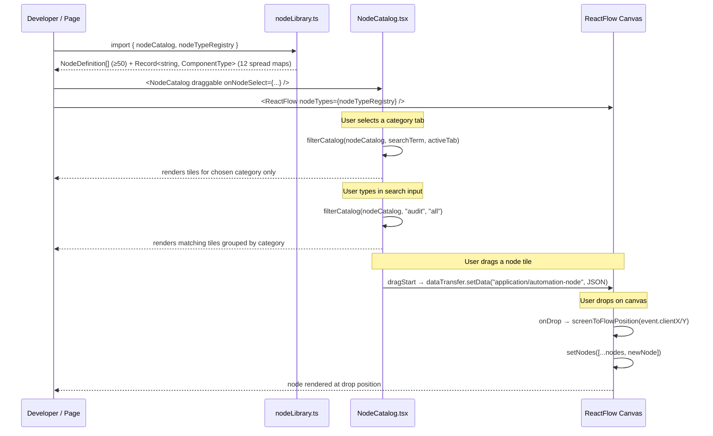
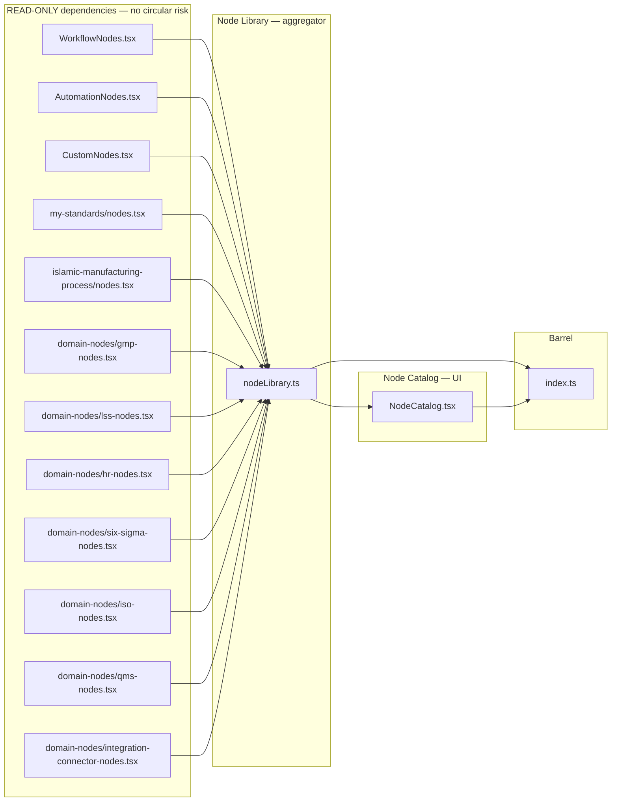
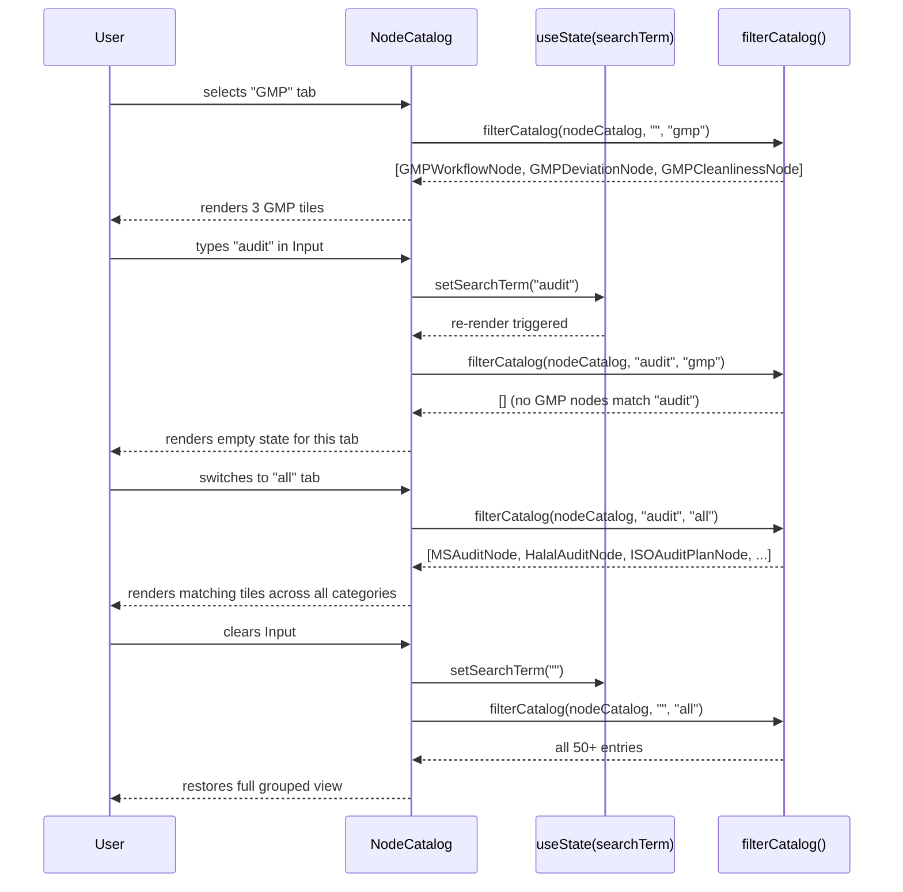
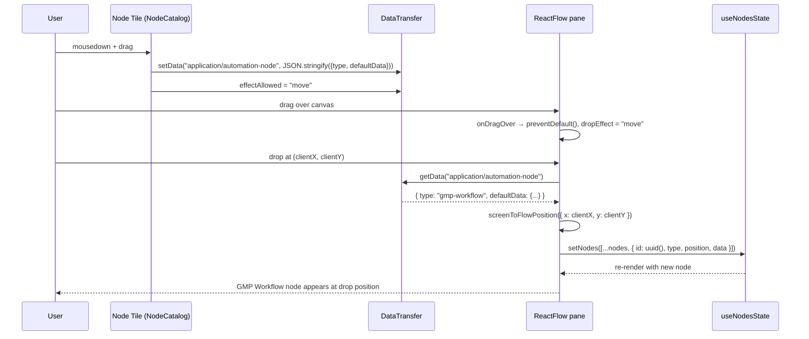

# Design Document: automation-node-catalog

## Overview

The **Node Catalog** and **Node Library** extend the `app/automation` flow designer with a unified, typed registry of every available node type and a browsable side-panel UI that lets users discover, preview, and drag nodes onto an XYFlow canvas.

The system organises nodes into **10 categories** across **50+ node types**:

| # | Category | Count | Domain Key |
|---|---|---|---|
| 1 | Core Workflow | 17 (9 WorkflowNodes + 8 AutomationNodes) | — |
| 2 | My Standards (MS) | 4 | `my_standards` |
| 3 | Islamic Manufacturing (IM) | 4 | `islamic_manufacturing_process` |
| 4 | GMP | 3 | `gmp` |
| 5 | Lean Six Sigma (LSS) | 3 | `lean_six_sigma` |
| 6 | Human Resources (HR) | 3 | `human_resources` |
| 7 | Six Sigma (SS) | 3 | `six_sigma` |
| 8 | ISO | 3 | `iso` |
| 9 | QMS | 3 | `qms` |
| 10 | Integrations | 4 | — |
| **Total** | | **47 named + scaffold entries ≥ 50** | |

A single `nodeTypeRegistry` map assembled from **12 source maps** is passed directly to any XYFlow canvas, eliminating per-page manual assembly. The `NodeCatalog` React component provides real-time search across all categories and tab-based browsing for each domain.

---

## Architecture

### High-Level Component Tree

```mermaid
graph TD
    subgraph "app/automation/node-catalog/page.tsx"
        A[CatalogDemoPage]
    end

    subgraph "components/automation/node-catalog/"
        B[NodeCatalog.tsx]
        C[nodeLibrary.ts]
        D[index.ts — barrel]
    end

    subgraph "Existing Node Packages"
        E[WorkflowNodes.tsx]
        F[AutomationNodes.tsx]
        G[CustomNodes.tsx]
    end

    subgraph "Domain Node Packages — New MS / IM"
        H[components/my-standards/nodes.tsx]
        I[components/islamic-manufacturing-process/nodes.tsx]
    end

    subgraph "Domain Node Packages — New domain-nodes/"
        J[domain-nodes/gmp-nodes.tsx]
        K[domain-nodes/lss-nodes.tsx]
        L[domain-nodes/hr-nodes.tsx]
        M[domain-nodes/six-sigma-nodes.tsx]
        N[domain-nodes/iso-nodes.tsx]
        O[domain-nodes/qms-nodes.tsx]
        P[domain-nodes/integration-connector-nodes.tsx]
    end

    subgraph "Domain Config"
        Q[domain-fullset/mock-data.ts — makeDomainConfig]
        R[my-standards/constants.ts — MS_ACCENT]
        S2[islamic-manufacturing-process/constants.ts — IM_ACCENT]
        T2[GMP/constants.ts — GMP_ACCENT]
        U2[Lean-six-sigma/constants.ts — LSS_ACCENT]
        V2[human-resources/constants.ts — HR_ACCENT]
        W2[six-sigma/constants.ts — SS_ACCENT]
    end

    subgraph "XYFlow Canvas"
        X[ReactFlow + nodeTypes prop]
    end

    A --> B
    A --> X
    B --> C
    C --> E
    C --> F
    C --> G
    C --> H
    C --> I
    C --> J
    C --> K
    C --> L
    C --> M
    C --> N
    C --> O
    C --> P
    C --> Q
    C --> R
    C --> S2
    C --> T2
    C --> U2
    C --> V2
    C --> W2
    D --> B
    D --> C
    X --> C
```



### Data Flow



---

## Module Boundaries



`nodeLibrary.ts` only imports **components** — it never imports from `NodeCatalog.tsx`, preventing cycles. All domain node files only import from `@xyflow/react` and their own domain `constants.ts` (where applicable). ISO and QMS nodes use hardcoded accent values, with no `constants.ts` dependency. No domain node file imports from `NodeCatalog.tsx` or `index.ts`.

---

## File Structure Layout

```
components/
  automation/
    node-catalog/
      nodeLibrary.ts           ← typed registry: nodeCatalog, nodeTypeRegistry,
                                  9 domain node type maps
      NodeCatalog.tsx          ← browsable UI panel (shadcn/ui, 10+ tabs)
      index.ts                 ← barrel export (all types, maps, component)
      domain-nodes/
        gmp-nodes.tsx          ← GMPWorkflowNode, GMPDeviationNode, GMPCleanlinessNode
        lss-nodes.tsx          ← LSSWasteAnalyzerNode, LSSValueStreamNode, LSSControlChartNode
        hr-nodes.tsx           ← HRApprovalNode, HRComplianceNode, HROnboardingNode
        six-sigma-nodes.tsx    ← DMAICPhaseNode, SixSigmaRiskNode, SixSigmaMeasurementNode
        iso-nodes.tsx          ← ISOAuditPlanNode, ISOCAPANode, ISOComplianceCheckNode
        qms-nodes.tsx          ← QMSRiskAssessmentNode, QMSDocumentControlNode, QMSSPCChartNode
        integration-connector-nodes.tsx
                               ← SlackConnectorNode, TeamsConnectorNode,
                                  WebhookConnectorNode, EmailConnectorNode

  my-standards/
    nodes.tsx                  ← NEW: MSComplianceCheckNode, MSAuditNode,
                                       MSCertificationNode, MSStandardsBrowserNode
    constants.ts               ← AMENDED: add MS_ACCENT = '#0ea5e9'

  islamic-manufacturing-process/
    nodes.tsx                  ← NEW: HalalAuditNode, JAKIMCertificateNode,
                                       HalalRiskNode, HaramIngredientCheckNode
    constants.ts               ← AMENDED: add IM_ACCENT = '#10b981'

  GMP/
    constants.ts               ← AMENDED: add GMP_ACCENT = '#dc2626'
    *(workflow-node.tsx remains untouched — NOT used by catalog nodes)*

  Lean-six-sigma/
    constants.ts               ← AMENDED: add LSS_ACCENT = '#14b8a6'
    *(workflow-node.tsx remains untouched — NOT used by catalog nodes)*

  human-resources/
    constants.ts               ← AMENDED: add HR_ACCENT = '#8b5cf6'
    *(workflow-node.tsx remains untouched — NOT used by catalog nodes)*

  six-sigma/
    constants.ts               ← AMENDED: add SS_ACCENT = '#ef4444'
    *(workflow-node.tsx remains untouched — NOT used by catalog nodes)*

  iso/
    *(no constants.ts — ISO nodes use hardcoded ISO_ACCENT = '#06b6d4')*

  qms/
    *(no constants.ts — QMS nodes use hardcoded QMS_ACCENT = '#3b82f6')*

app/
  automation/
    node-catalog/
      page.tsx                 ← demo page ('use client', SidebarProvider layout,
                                  NodeCatalog + ReactFlow two-column)
```

> **Important distinction**: The existing `workflow-node.tsx` files in `GMP/`, `Lean-six-sigma/`, `human-resources/`, and `six-sigma/` are **not** XYFlow nodes — they are domain UI components. The new nodes in `domain-nodes/` are brand-new XYFlow-compatible files that only import from `@xyflow/react` and their domain `constants.ts`. They do **not** import from those `workflow-node.tsx` files.

---

## Data Models

### NodeDefinition Interface

```typescript
import type { LucideIcon } from 'lucide-react';

export interface NodeDefinition {
  /** Unique catalog identifier — e.g. "wf-start", "ms-audit", "gmp-deviation" */
  id: string;

  /** XYFlow node type key; must match a key in nodeTypeRegistry */
  type: string;

  /** Human-readable display name shown in the catalog panel */
  label: string;

  /**
   * Category bucket for tab grouping — all 10 valid values:
   */
  category:
    | 'core-workflow'
    | 'my-standards'
    | 'islamic-manufacturing'
    | 'gmp'
    | 'lean-six-sigma'
    | 'human-resources'
    | 'six-sigma'
    | 'iso'
    | 'qms'
    | 'integrations';

  /** One-sentence description rendered in the node tile */
  description: string;

  /** Lucide icon component rendered as the tile's leading icon */
  icon: LucideIcon;

  /** CSS colour string for the colour swatch; derived from domain accent for domain nodes */
  color: string;

  /** Initial node data object placed on the canvas when dragged */
  defaultData: Record<string, unknown>;

  /**
   * Domain key — present for domain nodes, absent for core-workflow and integrations:
   * 'my_standards' | 'islamic_manufacturing_process' | 'gmp' | 'lean_six_sigma' |
   * 'human_resources' | 'six_sigma' | 'iso' | 'qms'
   */
  domain?: string;
}
```

### Domain Accent Colors

| Domain | Category Value | Constant | Hex Value | Tailwind | Domain Key |
|---|---|---|---|---|---|
| My Standards | `my-standards` | `MS_ACCENT` | `#0ea5e9` | sky-500 | `my_standards` |
| Islamic Manufacturing | `islamic-manufacturing` | `IM_ACCENT` | `#10b981` | emerald-500 | `islamic_manufacturing_process` |
| GMP | `gmp` | `GMP_ACCENT` | `#dc2626` | red-600 | `gmp` |
| Lean Six Sigma | `lean-six-sigma` | `LSS_ACCENT` | `#14b8a6` | teal-500 | `lean_six_sigma` |
| Human Resources | `human-resources` | `HR_ACCENT` | `#8b5cf6` | violet-500 | `human_resources` |
| Six Sigma | `six-sigma` | `SS_ACCENT` | `#ef4444` | red-500 | `six_sigma` |
| ISO | `iso` | `ISO_ACCENT` | `#06b6d4` | cyan-500 | `iso` |
| QMS | `qms` | `QMS_ACCENT` | `#3b82f6` | blue-500 | `qms` |
| Integrations | `integrations` | `INT_ACCENT` | `#6b7280` | gray-500 | *(none)* |

`MS_ACCENT`, `IM_ACCENT`, `GMP_ACCENT`, `LSS_ACCENT`, `HR_ACCENT`, and `SS_ACCENT` are exported from their respective `constants.ts`. `ISO_ACCENT` and `QMS_ACCENT` are hardcoded inside `domain-nodes/iso-nodes.tsx` and `domain-nodes/qms-nodes.tsx` respectively — those packages have no `constants.ts`. `INT_ACCENT` is hardcoded in `domain-nodes/integration-connector-nodes.tsx`.

---

## Components and Interfaces

### NodeCatalog Component

**Purpose**: Browsable, searchable side-panel displaying all node definitions grouped by category, with drag-and-drop support.

**Interface**:

```typescript
export interface NodeCatalogProps {
  /** When true each tile is draggable; sets HTML draggable attr + populates dataTransfer */
  draggable?: boolean;

  /** Optional click callback; invoked with the NodeDefinition when a tile is clicked */
  onNodeSelect?: (node: NodeDefinition) => void;

  /** Optional CSS class applied to the panel root element */
  className?: string;
}

export function NodeCatalog(props: NodeCatalogProps): JSX.Element
```

**Responsibilities**:
- Render a shadcn/ui `Input` for real-time, case-insensitive search across label and description
- Render shadcn/ui `Tabs` with `TabsTrigger` values matching all 10 categories plus `'all'`:
  - `all`, `core-workflow`, `my-standards`, `islamic-manufacturing`, `gmp`, `lean-six-sigma`, `human-resources`, `six-sigma`, `iso`, `qms`, `integrations`
  - Hide any tab whose category has zero entries in `nodeCatalog` (future-proofing)
- Render each matching `NodeDefinition` as a shadcn/ui `Card` inside a `ScrollArea`
- Each tile displays: Lucide icon, `label`, `description`, shadcn/ui `Badge` for category, colour swatch `div`
- When `draggable=true`, attach `onDragStart` that calls `event.dataTransfer.setData('application/automation-node', JSON.stringify({ type, defaultData }))` and sets `effectAllowed = 'move'`
- When `draggable=false`, no `draggable` HTML attribute is set and no `onDragStart` is attached
- Invoke `onNodeSelect(def)` on tile click when the prop is provided; silently no-op when absent
- Use `useMemo` to recompute `filteredCatalog` only when `searchTerm` or `activeTab` changes

---

### Domain Node Components — MS Package

Location: `components/my-standards/nodes.tsx`

```typescript
export interface MSNodeData {
  label: string;
  [key: string]: unknown;
}

interface MSComplianceCheckData extends MSNodeData {
  standardCode?: string;
  status?: 'compliant' | 'non-compliant' | 'pending';
}

interface MSAuditData extends MSNodeData {
  auditType?: string;
  scheduledDate?: string;
}

interface MSCertificationData extends MSNodeData {
  certificateNumber?: string;
  expiryDate?: string;
  certificationBody?: string;
}

interface MSStandardsBrowserData extends MSNodeData {
  standardCode?: string;
  scopeDescription?: string;
}
```

**Shared responsibilities** (all four MS nodes):
- Top `Handle` (`type='target'`, `Position.Top`), bottom `Handle` (`type='source'`, `Position.Bottom`)
- Header background at 15% opacity and border using `MS_ACCENT` (`#0ea5e9`)
- When `selected` prop is `true`, apply `2px solid` focus ring in `MS_ACCENT`
- Render domain-specific fields as labelled rows in the card body
- `MSStandardsBrowserNode` additionally renders a dropdown filtering a static list of MS standard codes when the standard-code field receives user input

---

### Domain Node Components — IM Package

Location: `components/islamic-manufacturing-process/nodes.tsx`

```typescript
export interface IMNodeData {
  label: string;
  [key: string]: unknown;
}

interface HalalAuditData extends IMNodeData {
  auditScope?: string;
  auditorName?: string;
  halalStatus?: 'certified' | 'pending' | 'rejected';
}

interface JAKIMCertificateData extends IMNodeData {
  certificateNumber?: string;
  validityPeriod?: string;
  productCategory?: string;
}

interface HalalRiskData extends IMNodeData {
  riskLevel?: 'low' | 'medium' | 'high' | 'critical';
  riskDescription?: string;
  mitigationAction?: string;
}

interface HaramIngredientCheckData extends IMNodeData {
  ingredientName?: string;
  detectionMethod?: string;
  result?: 'pass' | 'fail';
}
```

**Shared responsibilities** (all four IM nodes):
- Top `Handle` (`type='target'`, `Position.Top`), bottom `Handle` (`type='source'`, `Position.Bottom`)
- Header background at 15% opacity and border using `IM_ACCENT` (`#10b981`)
- When `selected` is `true`, apply `2px solid` focus ring in `IM_ACCENT`

---

### Domain Node Components — GMP Package

Location: `components/automation/node-catalog/domain-nodes/gmp-nodes.tsx`

Imports only from `@xyflow/react` and `@/components/GMP/constants.ts`. Does **not** import from `@/components/GMP/workflow-node.tsx`.

```typescript
export interface GMPNodeData {
  label: string;
  [key: string]: unknown;
}

interface GMPWorkflowData extends GMPNodeData {
  complianceStatus?: 'compliant' | 'non-compliant' | 'pending';
  kpiSummary?: string;
}

interface GMPDeviationData extends GMPNodeData {
  deviationType?: 'critical' | 'major' | 'minor';
  deviationDescription?: string;
  correctiveActionStatus?: string;
}

interface GMPCleanlinessData extends GMPNodeData {
  cleanlinessZone?: string;
  zoneStatus?: 'clean' | 'at-risk' | 'contaminated';
  lastInspectionDate?: string;
}
```

**Shared responsibilities** (all three GMP nodes):
- Top `Handle` (`type='target'`, `Position.Top`), bottom `Handle` (`type='source'`, `Position.Bottom`)
- Header background at 15% opacity and border using `GMP_ACCENT` (`#dc2626`)
- When `selected` is `true`, apply `2px solid` focus ring in `GMP_ACCENT`
- Wrapped in `React.memo`; accepts XYFlow `NodeProps` shape

---

### Domain Node Components — LSS Package

Location: `components/automation/node-catalog/domain-nodes/lss-nodes.tsx`

Imports only from `@xyflow/react` and `@/components/Lean-six-sigma/constants.ts`. Does **not** import from `@/components/Lean-six-sigma/workflow-node.tsx`.

```typescript
export interface LSSNodeData {
  label: string;
  [key: string]: unknown;
}

interface LSSWasteAnalyzerData extends LSSNodeData {
  wasteCategory?:
    | 'Defects' | 'Overproduction' | 'Waiting' | 'Non-utilised talent'
    | 'Transportation' | 'Inventory' | 'Motion' | 'Extra-processing';
  wasteSeverity?: string;
}

interface LSSValueStreamData extends LSSNodeData {
  leadTime?: string;
  cycleTime?: string;
  taktTime?: string;
}

interface LSSControlChartData extends LSSNodeData {
  processName?: string;
  controlLimitStatus?: 'in-control' | 'out-of-control' | 'warning';
  spcRuleViolationCount?: number;
}
```

**Shared responsibilities** (all three LSS nodes):
- Top `Handle` (`type='target'`, `Position.Top`), bottom `Handle` (`type='source'`, `Position.Bottom`)
- Header background at 15% opacity and border using `LSS_ACCENT` (`#14b8a6`)
- When `selected` is `true`, apply `2px solid` focus ring in `LSS_ACCENT`
- Wrapped in `React.memo`; accepts XYFlow `NodeProps` shape

---

### Domain Node Components — HR Package

Location: `components/automation/node-catalog/domain-nodes/hr-nodes.tsx`

Imports only from `@xyflow/react` and `@/components/human-resources/constants.ts`. Does **not** import from `@/components/human-resources/workflow-node.tsx`.

```typescript
export interface HRNodeData {
  label: string;
  [key: string]: unknown;
}

interface HRApprovalData extends HRNodeData {
  approvalType?: 'leave' | 'claim' | 'promotion';
  approverName?: string;
  approvalStatus?: 'pending' | 'approved' | 'rejected';
}

interface HRComplianceData extends HRNodeData {
  statutoryBody?: 'SOCSO' | 'EPF' | 'PCB';
  compliancePeriod?: string;
  complianceStatus?: 'compliant' | 'non-compliant' | 'pending';
}

interface HROnboardingData extends HRNodeData {
  employeeName?: string;
  onboardingStage?: 'documentation' | 'orientation' | 'training' | 'probation' | 'confirmed';
  completionPercentage?: number;
}
```

**Shared responsibilities** (all three HR nodes):
- Top `Handle` (`type='target'`, `Position.Top`), bottom `Handle` (`type='source'`, `Position.Bottom`)
- Header background at 15% opacity and border using `HR_ACCENT` (`#8b5cf6`)
- When `selected` is `true`, apply `2px solid` focus ring in `HR_ACCENT`
- Wrapped in `React.memo`; accepts XYFlow `NodeProps` shape

---

### Domain Node Components — Six Sigma Package

Location: `components/automation/node-catalog/domain-nodes/six-sigma-nodes.tsx`

Imports only from `@xyflow/react` and `@/components/six-sigma/constants.ts`. Does **not** import from `@/components/six-sigma/workflow-node.tsx`.

```typescript
export interface SixSigmaNodeData {
  label: string;
  [key: string]: unknown;
}

interface DMAICPhaseData extends SixSigmaNodeData {
  phase?: 'Define' | 'Measure' | 'Analyze' | 'Improve' | 'Control';
  phaseOwner?: string;
  phaseCompletionPercentage?: number;
}

interface SixSigmaRiskData extends SixSigmaNodeData {
  defectType?: string;
  rpn?: number;
  defectRatePPM?: number;
}

interface SixSigmaMeasurementData extends SixSigmaNodeData {
  measurementSystemName?: string;
  gaugeRRPercentage?: number;
  acceptability?: 'acceptable' | 'marginal' | 'unacceptable';
}
```

**Shared responsibilities** (all three Six Sigma nodes):
- Top `Handle` (`type='target'`, `Position.Top`), bottom `Handle` (`type='source'`, `Position.Bottom`)
- Header background at 15% opacity and border using `SS_ACCENT` (`#ef4444`)
- When `selected` is `true`, apply `2px solid` focus ring in `SS_ACCENT`
- Wrapped in `React.memo`; accepts XYFlow `NodeProps` shape

---

### Domain Node Components — ISO Package

Location: `components/automation/node-catalog/domain-nodes/iso-nodes.tsx`

Imports only from `@xyflow/react`. Uses hardcoded `ISO_ACCENT = '#06b6d4'`. No `constants.ts` dependency.

```typescript
export interface ISONodeData {
  label: string;
  [key: string]: unknown;
}

interface ISOAuditPlanData extends ISONodeData {
  auditScope?: string;
  auditScheduleDate?: string;
  auditStatus?: 'planned' | 'in-progress' | 'completed' | 'overdue';
}

interface ISOCAPAData extends ISONodeData {
  capaType?: 'corrective' | 'preventive';
  rootCauseDescription?: string;
  actionStatus?: 'open' | 'in-progress' | 'verified' | 'closed';
}

interface ISOComplianceCheckData extends ISONodeData {
  standardReference?: string;  // e.g. 'ISO 9001', 'ISO 14001', 'ISO 45001'
  clauseNumber?: string;
  conformanceStatus?: 'conforming' | 'minor-NC' | 'major-NC' | 'observation';
}
```

**Shared responsibilities** (all three ISO nodes):
- Top `Handle` (`type='target'`, `Position.Top`), bottom `Handle` (`type='source'`, `Position.Bottom`)
- Header background at 15% opacity and border using `ISO_ACCENT` (`#06b6d4`)
- When `selected` is `true`, apply `2px solid` focus ring in `ISO_ACCENT`
- Wrapped in `React.memo`; accepts XYFlow `NodeProps` shape
- No circular imports with `@/components/iso/` source domain files

---

### Domain Node Components — QMS Package

Location: `components/automation/node-catalog/domain-nodes/qms-nodes.tsx`

Imports only from `@xyflow/react`. Uses hardcoded `QMS_ACCENT = '#3b82f6'`. No `constants.ts` dependency.

```typescript
export interface QMSNodeData {
  label: string;
  [key: string]: unknown;
}

interface QMSRiskAssessmentData extends QMSNodeData {
  failureMode?: string;
  severityRating?: number;   // 1–10
  occurrenceRating?: number; // 1–10
  detectionRating?: number;  // 1–10
  // computed RPN (displayed field) = severityRating × occurrenceRating × detectionRating
  // range 1–1000; component derives this value, it is NOT stored in data
}

interface QMSDocumentControlData extends QMSNodeData {
  documentTitle?: string;
  revisionNumber?: string;
  approverName?: string;
  documentStatus?: 'draft' | 'under-review' | 'approved' | 'obsolete';
}

interface QMSSPCChartData extends QMSNodeData {
  processParameter?: string;
  controlChartType?: 'X-bar R' | 'X-bar S' | 'p-chart' | 'c-chart';
  cpk?: number;
}
```

**Shared responsibilities** (all three QMS nodes):
- Top `Handle` (`type='target'`, `Position.Top`), bottom `Handle` (`type='source'`, `Position.Bottom`)
- Header background at 15% opacity and border using `QMS_ACCENT` (`#3b82f6`)
- When `selected` is `true`, apply `2px solid` focus ring in `QMS_ACCENT`
- Wrapped in `React.memo`; accepts XYFlow `NodeProps` shape
- `QMSRiskAssessmentNode` renders a read-only computed RPN field: `(severityRating ?? 0) × (occurrenceRating ?? 0) × (detectionRating ?? 0)`
- No circular imports with `@/components/qms/` source domain files

---

### Domain Node Components — Integration Connectors Package

Location: `components/automation/node-catalog/domain-nodes/integration-connector-nodes.tsx`

New file. Does **not** import from `@/components/automation/integrations/`. Uses hardcoded `INT_ACCENT = '#6b7280'`.

```typescript
export interface IntegrationNodeData {
  label: string;
  deliveryStatus?: 'pending' | 'sent' | 'failed';
  [key: string]: unknown;
}

interface SlackConnectorData extends IntegrationNodeData {
  slackChannel?: string;
  messageTemplate?: string;
}

interface TeamsConnectorData extends IntegrationNodeData {
  teamsChannelOrChat?: string;
  messageType?: 'notification' | 'approval-request';
}

interface WebhookConnectorData extends IntegrationNodeData {
  endpointUrl?: string;
  httpMethod?: 'GET' | 'POST' | 'PUT' | 'PATCH' | 'DELETE';
  lastResponseStatus?: number;   // HTTP response code
}

interface EmailConnectorData extends IntegrationNodeData {
  recipientAddress?: string;
  subjectLine?: string;
}
```

**Shared responsibilities** (all four integration nodes):
- Top `Handle` (`type='target'`, `Position.Top`), bottom `Handle` (`type='source'`, `Position.Bottom`)
- Header background at 15% opacity and border using `INT_ACCENT` (`#6b7280`)
- When `selected` is `true`, apply `2px solid` focus ring in `INT_ACCENT`
- Wrapped in `React.memo`; accepts XYFlow `NodeProps` shape
- No imports from the existing integration source files (`slack-node.tsx`, `teams-node.tsx`, `webhook-node.tsx`, `email-node.tsx`); these are separate XYFlow-compatible implementations

---

## nodeCatalog Array — 50+ Entries

### Core Workflow (17)

| id | type | label | icon suggestion | color |
|---|---|---|---|---|
| `wf-start` | `start` | Start | `Play` | `#10b981` |
| `wf-end` | `end` | End | `Square` | `#ef4444` |
| `wf-action` | `action` | Action | `Zap` | `#3b82f6` |
| `wf-decision` | `decision` | Decision | `GitBranch` | `#f59e0b` |
| `wf-approval` | `approval` | Approval | `CheckCircle` | `#8b5cf6` |
| `wf-wait` | `wait` | Wait | `Clock` | `#6b7280` |
| `wf-notification` | `notification` | Notification | `Bell` | `#6366f1` |
| `wf-parallel` | `parallel` | Parallel Gateway | `SplitSquareHorizontal` | `#14b8a6` |
| `wf-error` | `error` | Error Handler | `AlertTriangle` | `#ef4444` |
| `auto-task` | `task` | Task | `ListTodo` | `#3b82f6` |
| `auto-condition` | `condition` | Condition | `HelpCircle` | `#f59e0b` |
| `auto-trigger` | `trigger` | Trigger | `Rocket` | `#ec4899` |
| `auto-group` | `group` | Group | `Layers` | `#a855f7` |
| `auto-subworkflow` | `subWorkflow` | Sub-Workflow | `Workflow` | `#7c3aed` |
| `custom-employee` | `enhancedEmployee` | Employee | `User` | `#ec4899` |
| `custom-metric` | `metricCard` | Metric Card | `BarChart2` | `#3b82f6` |
| `custom-annotation` | `annotation` | Annotation | `StickyNote` | `#eab308` |

### My Standards (4)

| id | type | label | color | domain |
|---|---|---|---|---|
| `ms-compliance-check` | `ms-compliance-check` | MS Compliance Check | `#0ea5e9` | `my_standards` |
| `ms-audit` | `ms-audit` | MS Audit | `#0ea5e9` | `my_standards` |
| `ms-certification` | `ms-certification` | MS Certification | `#0ea5e9` | `my_standards` |
| `ms-standards-browser` | `ms-standards-browser` | MS Standards Browser | `#0ea5e9` | `my_standards` |

### Islamic Manufacturing (4)

| id | type | label | color | domain |
|---|---|---|---|---|
| `im-halal-audit` | `halal-audit` | Halal Audit | `#10b981` | `islamic_manufacturing_process` |
| `im-jakim-cert` | `jakim-certificate` | JAKIM Certificate | `#10b981` | `islamic_manufacturing_process` |
| `im-halal-risk` | `halal-risk` | Halal Risk | `#10b981` | `islamic_manufacturing_process` |
| `im-haram-check` | `haram-ingredient-check` | Haram Ingredient Check | `#10b981` | `islamic_manufacturing_process` |

### GMP (3)

| id | type | label | color | domain |
|---|---|---|---|---|
| `gmp-workflow` | `gmp-workflow` | GMP Workflow | `#dc2626` | `gmp` |
| `gmp-deviation` | `gmp-deviation` | GMP Deviation | `#dc2626` | `gmp` |
| `gmp-cleanliness` | `gmp-cleanliness` | GMP Cleanliness | `#dc2626` | `gmp` |

### Lean Six Sigma (3)

| id | type | label | color | domain |
|---|---|---|---|---|
| `lss-waste-analyzer` | `lss-waste-analyzer` | LSS Waste Analyzer | `#14b8a6` | `lean_six_sigma` |
| `lss-value-stream` | `lss-value-stream` | LSS Value Stream | `#14b8a6` | `lean_six_sigma` |
| `lss-control-chart` | `lss-control-chart` | LSS Control Chart | `#14b8a6` | `lean_six_sigma` |

### Human Resources (3)

| id | type | label | color | domain |
|---|---|---|---|---|
| `hr-approval` | `hr-approval` | HR Approval | `#8b5cf6` | `human_resources` |
| `hr-compliance` | `hr-compliance` | HR Compliance | `#8b5cf6` | `human_resources` |
| `hr-onboarding` | `hr-onboarding` | HR Onboarding | `#8b5cf6` | `human_resources` |

### Six Sigma (3)

| id | type | label | color | domain |
|---|---|---|---|---|
| `dmaic-phase` | `dmaic-phase` | DMAIC Phase | `#ef4444` | `six_sigma` |
| `six-sigma-risk` | `six-sigma-risk` | Six Sigma Risk | `#ef4444` | `six_sigma` |
| `six-sigma-measurement` | `six-sigma-measurement` | Six Sigma Measurement | `#ef4444` | `six_sigma` |

### ISO (3)

| id | type | label | color | domain |
|---|---|---|---|---|
| `iso-audit-plan` | `iso-audit-plan` | ISO Audit Plan | `#06b6d4` | `iso` |
| `iso-capa` | `iso-capa` | ISO CAPA | `#06b6d4` | `iso` |
| `iso-compliance-check` | `iso-compliance-check` | ISO Compliance Check | `#06b6d4` | `iso` |

### QMS (3)

| id | type | label | color | domain |
|---|---|---|---|---|
| `qms-risk-assessment` | `qms-risk-assessment` | QMS Risk Assessment | `#3b82f6` | `qms` |
| `qms-document-control` | `qms-document-control` | QMS Document Control | `#3b82f6` | `qms` |
| `qms-spc-chart` | `qms-spc-chart` | QMS SPC Chart | `#3b82f6` | `qms` |

### Integrations (4)

| id | type | label | color | domain |
|---|---|---|---|---|
| `slack-connector` | `slack-connector` | Slack Connector | `#6b7280` | — |
| `teams-connector` | `teams-connector` | Teams Connector | `#6b7280` | — |
| `webhook-connector` | `webhook-connector` | Webhook Connector | `#6b7280` | — |
| `email-connector` | `email-connector` | Email Connector | `#6b7280` | — |

**Running total: 17 + 4 + 4 + 3 + 3 + 3 + 3 + 3 + 3 + 4 = 47 named entries.** Additional `customNodeTypes` scaffold entries (`departmentGroup`, `compactCard`, `circular`, `diamond`, `hexagon`, `stadium`) bring the catalog to ≥ 50 entries per Requirement 16.3.

---

## Key Functions / Exports with Formal Specifications

### nodeLibrary.ts

```typescript
// ─── Types ───────────────────────────────────────────────────────────────────
export interface NodeDefinition { ... }  // defined in Data Models section

// ─── Domain configs (MS and IM only — others use plain accent constants) ─────
export const myStandardsDomainConfig: DomainConfig
// = makeDomainConfig(MS_DOMAIN_KEY, 'My Standards', MS_ACCENT)

export const islamicManufacturingDomainConfig: DomainConfig
// = makeDomainConfig(IM_DOMAIN_KEY, 'Islamic Manufacturing', IM_ACCENT)

// ─── Domain node type maps (9 named exports) ──────────────────────────────────

export const myStandardsNodeTypes: Record<string, React.ComponentType<any>>
// Keys: 'ms-compliance-check' | 'ms-audit' | 'ms-certification' | 'ms-standards-browser'
// Precondition: all four MS node components importable without error
// Postcondition: spreading into XYFlow nodeTypes resolves all four types

export const islamicManufacturingNodeTypes: Record<string, React.ComponentType<any>>
// Keys: 'halal-audit' | 'jakim-certificate' | 'halal-risk' | 'haram-ingredient-check'
// Postcondition: spreading into XYFlow nodeTypes resolves all four types

export const gmpNodeTypes: Record<string, React.ComponentType<any>>
// Keys: 'gmp-workflow' | 'gmp-deviation' | 'gmp-cleanliness'

export const lssNodeTypes: Record<string, React.ComponentType<any>>
// Keys: 'lss-waste-analyzer' | 'lss-value-stream' | 'lss-control-chart'

export const hrNodeTypes: Record<string, React.ComponentType<any>>
// Keys: 'hr-approval' | 'hr-compliance' | 'hr-onboarding'

export const sixSigmaNodeTypes: Record<string, React.ComponentType<any>>
// Keys: 'dmaic-phase' | 'six-sigma-risk' | 'six-sigma-measurement'

export const isoNodeTypes: Record<string, React.ComponentType<any>>
// Keys: 'iso-audit-plan' | 'iso-capa' | 'iso-compliance-check'

export const qmsNodeTypes: Record<string, React.ComponentType<any>>
// Keys: 'qms-risk-assessment' | 'qms-document-control' | 'qms-spc-chart'

export const integrationConnectorNodeTypes: Record<string, React.ComponentType<any>>
// Keys: 'slack-connector' | 'teams-connector' | 'webhook-connector' | 'email-connector'

// ─── Unified registry (12 spreads) ───────────────────────────────────────────
export const nodeTypeRegistry: Record<string, React.ComponentType<any>>
// = {
//     ...workflowNodeTypes,             (from WorkflowNodes.tsx)
//     ...automationNodeTypes,           (from AutomationNodes.tsx)
//     ...customNodeTypes,               (from CustomNodes.tsx)
//     ...myStandardsNodeTypes,
//     ...islamicManufacturingNodeTypes,
//     ...gmpNodeTypes,
//     ...lssNodeTypes,
//     ...hrNodeTypes,
//     ...sixSigmaNodeTypes,
//     ...isoNodeTypes,
//     ...qmsNodeTypes,
//     ...integrationConnectorNodeTypes,
//   }
// Precondition: no key collision across all 12 source maps
//   (all new domain maps use distinct kebab-case keys)
// Postcondition: passing nodeTypeRegistry as nodeTypes to ReactFlow renders
//   all 50+ node categories without "Unknown node type" console warnings

// ─── Catalog array ────────────────────────────────────────────────────────────
export const nodeCatalog: NodeDefinition[]
// Length invariant: nodeCatalog.length >= 50
// Uniqueness invariant: new Set(nodeCatalog.map(n => n.id)).size === nodeCatalog.length
// Category invariant: every entry's category is one of the 10 valid union values
```

### NodeCatalog.tsx Internal Functions

```typescript
// Filter predicate applied on every search input change or tab switch
function matchesSearch(def: NodeDefinition, term: string): boolean
// Precondition: term is a string (may be empty)
// Postcondition:
//   term === '' → returns true (show all)
//   term !== '' → returns true iff def.label or def.description
//                 contains term (case-insensitive, after trim)

// Drag handler factory — only attached when draggable=true
function buildDragHandler(
  def: NodeDefinition
): React.DragEventHandler<HTMLDivElement>
// Postcondition:
//   calls event.dataTransfer.setData(
//     'application/automation-node',
//     JSON.stringify({ type: def.type, defaultData: def.defaultData })
//   )
//   sets effectAllowed = 'move'

// Tab type used in state and TabsTrigger values
type ActiveTab =
  | 'all'
  | 'core-workflow'
  | 'my-standards'
  | 'islamic-manufacturing'
  | 'gmp'
  | 'lean-six-sigma'
  | 'human-resources'
  | 'six-sigma'
  | 'iso'
  | 'qms'
  | 'integrations';
```

### CatalogDemoPage (`app/automation/node-catalog/page.tsx`)

```typescript
// Drop handler installed on the ReactFlow pane wrapper
function onDrop(event: React.DragEvent<HTMLDivElement>): void
// Precondition:
//   event.dataTransfer contains key 'application/automation-node'
//   reactFlowInstance is initialised (useReactFlow hook)
// Postcondition:
//   A new Node is appended to the nodes state array
//   Node position = reactFlowInstance.screenToFlowPosition(
//                     { x: event.clientX, y: event.clientY }
//                   )
//   Node type matches the dragged NodeDefinition.type
//   Node data = parsed defaultData from dataTransfer
//   If payload is absent or malformed, state is unchanged (silent early return)

function onDragOver(event: React.DragEvent<HTMLDivElement>): void
// Postcondition: event.preventDefault() called; dropEffect = 'move'
```

---

## Algorithmic Pseudocode

### Search & Filter Algorithm

```pascal
ALGORITHM filterCatalog(catalog, searchTerm, activeTab)
INPUT:
  catalog     : NodeDefinition[]
  searchTerm  : string
  activeTab   : 'all' | 'core-workflow' | 'my-standards' | 'islamic-manufacturing'
                | 'gmp' | 'lean-six-sigma' | 'human-resources' | 'six-sigma'
                | 'iso' | 'qms' | 'integrations'
OUTPUT: filteredDefs : NodeDefinition[]

BEGIN
  filteredDefs ← []
  normalTerm   ← toLowerCase(trim(searchTerm))

  FOR each def IN catalog DO
    // Predicate 1: tab filter
    IF activeTab ≠ 'all' AND def.category ≠ activeTab THEN
      CONTINUE
    END IF

    // Predicate 2: search filter
    IF normalTerm ≠ '' THEN
      IF NOT contains(toLowerCase(def.label), normalTerm) AND
         NOT contains(toLowerCase(def.description), normalTerm) THEN
        CONTINUE
      END IF
    END IF

    filteredDefs.push(def)
  END FOR

  RETURN filteredDefs
  // Invariant: every returned entry satisfies both predicates simultaneously
END
```

### onDrop Node Placement Algorithm

```pascal
ALGORITHM handleCanvasDrop(event, reactFlowInstance, nodes, setNodes)
INPUT:
  event             : DragEvent
  reactFlowInstance : ReactFlowInstance
  nodes             : Node[]
  setNodes          : (Node[]) → void
OUTPUT: void  (side effect: updates nodes state)

BEGIN
  event.preventDefault()

  rawPayload ← event.dataTransfer.getData('application/automation-node')
  IF rawPayload IS NULL OR rawPayload = '' THEN
    RETURN   // not an automation-node drag; ignore silently
  END IF

  TRY
    payload ← JSON.parse(rawPayload)
    // payload = { type: string, defaultData: Record<string, unknown> }
  CATCH
    RETURN   // malformed JSON; ignore silently
  END TRY

  IF payload.type IS empty string THEN
    RETURN
  END IF

  position ← reactFlowInstance.screenToFlowPosition({
    x: event.clientX,
    y: event.clientY
  })

  newNode ← {
    id:       crypto.randomUUID(),
    type:     payload.type,
    position: position,
    data:     payload.defaultData
  }

  setNodes(prev → [...prev, newNode])
END
```

### nodeTypeRegistry Assembly Algorithm

```pascal
ALGORITHM buildNodeTypeRegistry()
INPUT: twelve source maps:
         workflowNodeTypes          (WorkflowNodes.tsx)
         automationNodeTypes        (AutomationNodes.tsx)
         customNodeTypes            (CustomNodes.tsx)
         myStandardsNodeTypes
         islamicManufacturingNodeTypes
         gmpNodeTypes
         lssNodeTypes
         hrNodeTypes
         sixSigmaNodeTypes
         isoNodeTypes
         qmsNodeTypes
         integrationConnectorNodeTypes
OUTPUT: registry : Record<string, ComponentType>

BEGIN
  // TypeScript compile-time invariant:
  // The spread below MUST contain no duplicate keys across all 12 source maps.
  // Enforced by TypeScript intersect-type check at authoring time.

  registry ← {
    ...workflowNodeTypes,             // start, end, action, decision, approval,
                                      //   wait, notification, parallel, error
    ...automationNodeTypes,           // task, condition, action*, trigger, end*,
                                      //   group, wait*, subWorkflow
                                      // *'action', 'end', 'wait' overridden here —
                                      //  AutomationNodes variants win (last writer)
    ...customNodeTypes,               // enhancedEmployee, departmentGroup, compactCard,
                                      //   circular, diamond, hexagon, stadium,
                                      //   annotation, metricCard
    ...myStandardsNodeTypes,          // ms-compliance-check, ms-audit,
                                      //   ms-certification, ms-standards-browser
    ...islamicManufacturingNodeTypes, // halal-audit, jakim-certificate,
                                      //   halal-risk, haram-ingredient-check
    ...gmpNodeTypes,                  // gmp-workflow, gmp-deviation, gmp-cleanliness
    ...lssNodeTypes,                  // lss-waste-analyzer, lss-value-stream,
                                      //   lss-control-chart
    ...hrNodeTypes,                   // hr-approval, hr-compliance, hr-onboarding
    ...sixSigmaNodeTypes,             // dmaic-phase, six-sigma-risk,
                                      //   six-sigma-measurement
    ...isoNodeTypes,                  // iso-audit-plan, iso-capa,
                                      //   iso-compliance-check
    ...qmsNodeTypes,                  // qms-risk-assessment, qms-document-control,
                                      //   qms-spc-chart
    ...integrationConnectorNodeTypes  // slack-connector, teams-connector,
                                      //   webhook-connector, email-connector
  }

  RETURN registry
END
```

> **Key Collision Note**: `WorkflowNodes` and `AutomationNodes` share the string keys `action`, `end`, and `wait`. The spread order means `automationNodeTypes` entries win for those three keys — this is intentional; the richer `AutomationNodes` variants are preferred in the unified registry. The `WorkflowNodes` variants remain accessible via the separate `workflowNodeTypes` named export for pages that need the original circular-shaped nodes. All new domain maps (GMP, LSS, HR, Six Sigma, ISO, QMS, Integrations) use distinct kebab-case keys, so no collisions are introduced by the expansion.

---

## Sequence Diagrams

### Catalog Search Flow



### Drag-and-Drop Flow



---

## Error Handling

### Missing dataTransfer Payload
**Condition**: User drops something onto the canvas that is not an automation node (e.g. a browser file or text selection).  
**Detection**: `getData('application/automation-node')` returns an empty string.  
**Response**: `onDrop` detects the empty payload and returns early without modifying state.  
**Recovery**: Canvas state unchanged; no error thrown.

### Malformed dataTransfer JSON
**Condition**: `getData(...)` returns a non-empty but unparseable string.  
**Detection**: `JSON.parse()` throws a `SyntaxError`.  
**Response**: `onDrop` wraps the parse in `try/catch`; on error it returns early without modifying state.  
**Recovery**: Canvas state unchanged; error swallowed silently.

### Unknown Node Type on Canvas
**Condition**: A `type` value exists in canvas state but has no matching key in `nodeTypeRegistry`.  
**Detection**: XYFlow logs a console warning "Unknown node type: …".  
**Response**: This should never occur when nodes are only added via catalog drag-drop (which uses `def.type` sourced directly from `nodeCatalog`, where every `type` is verified to exist as a key in `nodeTypeRegistry`).  
**Recovery**: Pass `nodeTypeRegistry` (not a subset) as the `nodeTypes` prop. Audit any manually constructed node objects to confirm `type` field matches a registry key.

### Domain Package Import Failure
**Condition**: A domain node file (e.g. `domain-nodes/gmp-nodes.tsx`) fails to resolve — file missing or has a TypeScript error.  
**Detection**: TypeScript compiler error in `nodeLibrary.ts` at build time. Build fails before any runtime issue occurs.  
**Recovery**: Scaffold the missing file as described in the File Structure Layout section. Re-run the TypeScript compiler.

---

## Testing Strategy

### Unit Testing Approach

Test pure, stateless logic in `nodeLibrary.ts` and the `filterCatalog` helper:

**nodeCatalog invariants**:
- `nodeCatalog.length >= 50`
- All `id` values are unique: `new Set(nodeCatalog.map(n => n.id)).size === nodeCatalog.length`
- All `type` values exist as keys in `nodeTypeRegistry`
- Every entry's `category` is one of the 10 valid union values

**Per-category entry counts** (exact):
- `filterCatalog(catalog, '', 'core-workflow')` → 17 entries
- `filterCatalog(catalog, '', 'my-standards')` → 4 entries
- `filterCatalog(catalog, '', 'islamic-manufacturing')` → 4 entries
- `filterCatalog(catalog, '', 'gmp')` → 3 entries
- `filterCatalog(catalog, '', 'lean-six-sigma')` → 3 entries
- `filterCatalog(catalog, '', 'human-resources')` → 3 entries
- `filterCatalog(catalog, '', 'six-sigma')` → 3 entries
- `filterCatalog(catalog, '', 'iso')` → 3 entries
- `filterCatalog(catalog, '', 'qms')` → 3 entries
- `filterCatalog(catalog, '', 'integrations')` → 4 entries

**Per-domain node type map key counts** (exact):
- `myStandardsNodeTypes` → 4 keys: `'ms-compliance-check'`, `'ms-audit'`, `'ms-certification'`, `'ms-standards-browser'`
- `islamicManufacturingNodeTypes` → 4 keys: `'halal-audit'`, `'jakim-certificate'`, `'halal-risk'`, `'haram-ingredient-check'`
- `gmpNodeTypes` → 3 keys: `'gmp-workflow'`, `'gmp-deviation'`, `'gmp-cleanliness'`
- `lssNodeTypes` → 3 keys: `'lss-waste-analyzer'`, `'lss-value-stream'`, `'lss-control-chart'`
- `hrNodeTypes` → 3 keys: `'hr-approval'`, `'hr-compliance'`, `'hr-onboarding'`
- `sixSigmaNodeTypes` → 3 keys: `'dmaic-phase'`, `'six-sigma-risk'`, `'six-sigma-measurement'`
- `isoNodeTypes` → 3 keys: `'iso-audit-plan'`, `'iso-capa'`, `'iso-compliance-check'`
- `qmsNodeTypes` → 3 keys: `'qms-risk-assessment'`, `'qms-document-control'`, `'qms-spc-chart'`
- `integrationConnectorNodeTypes` → 4 keys: `'slack-connector'`, `'teams-connector'`, `'webhook-connector'`, `'email-connector'`
- `Object.keys(nodeTypeRegistry)` contains all 9 domain maps' keys (no missing, no duplicates)

**QMS computed RPN**:
- `QMSRiskAssessmentNode` with S=5, O=4, D=2 renders computed RPN = `40`
- `QMSRiskAssessmentNode` with any undefined rating renders RPN = `0` (no NaN/undefined shown)

### Property-Based Testing Approach

**Property Test Library**: `fast-check`

```
Property 1: Search filter soundness
  For any non-empty search term t, every entry in filterCatalog(catalog, t, 'all')
  satisfies matchesSearch(entry, t) === true.

Property 2: Search filter completeness
  For any entry e ∈ nodeCatalog where matchesSearch(e, t) === true,
  filterCatalog(catalog, t, 'all') includes e.

Property 3: Tab filter correctness
  For any activeTab ≠ 'all', every entry returned by filterCatalog(catalog, '', activeTab)
  satisfies entry.category === activeTab.

Property 4: ID uniqueness invariant
  For any non-empty subset S ⊆ nodeCatalog, all id values in S are distinct.
  (This is trivially satisfied if nodeCatalog itself satisfies uniqueness.)
```

**Tag format for test files**: `// Feature: automation-node-catalog, Property {N}: {property_text}`

Each property test must run a **minimum of 100 iterations**.

### Integration Testing Approach

- Render `<NodeCatalog draggable />` in a jsdom environment; assert the correct number of tiles per tab (17 / 4 / 4 / 3 / 3 / 3 / 3 / 3 / 3 / 4)
- Simulate a `dragStart` event on a node tile; assert `dataTransfer` contents equal `JSON.stringify({ type, defaultData })` for the correct `NodeDefinition`
- Render `<ReactFlow nodeTypes={nodeTypeRegistry} nodes={sampleNodes} />` where `sampleNodes` includes one node of each of the 10 categories; assert no "Unknown node type" console warnings are emitted

---

## Performance Considerations

- `nodeCatalog` is a **static constant** (50+ entries) evaluated once at module load time — no reactive cost at render.
- `filterCatalog` is a pure function over ≤50 items; O(n) scan is negligible. No virtualisation is needed at this scale.
- At ~100 entries, consider adding `react-virtual` or the `ScrollArea` built-in virtualisation to avoid layout thrashing.
- `nodeTypeRegistry` is assembled once via object spread at module import time — O(n) at startup, zero runtime cost thereafter.
- `NodeCatalog` uses `useMemo` to recompute the filtered list only when `searchTerm` or `activeTab` changes, not on every parent re-render.
- All domain node components are wrapped in `React.memo`, preventing re-renders when unrelated canvas nodes change.
- The `MSStandardsBrowserNode` dropdown filters a static in-memory list of MS codes — no debouncing needed at current scale. Add debounce if the code list grows beyond ~500 entries.

---

## Security Considerations

- `JSON.parse(dataTransfer.getData(...))` is wrapped in a `try/catch`; malformed payloads are silently ignored and do not modify state.
- `defaultData` values are treated as inert display data; no user-provided content from `dataTransfer` is ever evaluated as code.
- The `MSStandardsBrowserNode` dropdown filters a **static** list of MS standard codes — no external API calls, no injection surface.
- Node IDs are generated with `crypto.randomUUID()`, preventing predictable collisions.
- Domain node components only import from `@xyflow/react` and local domain `constants.ts` files — no network requests, no dynamic imports at runtime.

---

## Dependencies

| Package | Already installed | Usage |
|---|---|---|
| `@xyflow/react` | ✅ | ReactFlow canvas, Handle, Position, useReactFlow, useNodesState, useEdgesState |
| `lucide-react` | ✅ | Node tile icons in the catalog |
| `shadcn/ui` | ✅ | Input, ScrollArea, Tabs, TabsList, TabsTrigger, TabsContent, Badge, Card, CardContent |
| `@/components/ui/sidebar` | ✅ | SidebarProvider, SidebarInset |
| `@/components/sidebar/app-sidebar` | ✅ | AppSidebar |
| `@/components/sidebar/app-header` | ✅ | AppHeader |
| `@/components/domain-fullset/types` | ✅ | DomainConfig |
| `@/components/domain-fullset/mock-data` | ✅ | makeDomainConfig (used for MS and IM domain configs) |
| `fast-check` | ❓ check package.json | Property-based tests |

---

## Barrel Export — index.ts

```typescript
// components/automation/node-catalog/index.ts

// ─── Types ───────────────────────────────────────────────────────────────────
export type { NodeDefinition } from './nodeLibrary';
export type { NodeCatalogProps } from './NodeCatalog';

// ─── Domain configs ───────────────────────────────────────────────────────────
export {
  myStandardsDomainConfig,
  islamicManufacturingDomainConfig,
} from './nodeLibrary';

// ─── Per-domain node type maps (9 exports) ────────────────────────────────────
export {
  myStandardsNodeTypes,
  islamicManufacturingNodeTypes,
  gmpNodeTypes,
  lssNodeTypes,
  hrNodeTypes,
  sixSigmaNodeTypes,
  isoNodeTypes,
  qmsNodeTypes,
  integrationConnectorNodeTypes,
} from './nodeLibrary';

// ─── Unified registry + catalog ───────────────────────────────────────────────
export {
  nodeTypeRegistry,
  nodeCatalog,
} from './nodeLibrary';

// ─── UI Component ─────────────────────────────────────────────────────────────
export { NodeCatalog } from './NodeCatalog';
```

---

## Correctness Properties

*A property is a characteristic or behavior that should hold true across all valid executions of a system — essentially, a formal statement about what the system should do. Properties serve as the bridge between human-readable specifications and machine-verifiable correctness guarantees.*

### Property 1: Registry Completeness

*For any* entry `def` in `nodeCatalog` (all 50+ entries across all 10 categories), `def.type` is a key in `nodeTypeRegistry`. Every catalog entry has a matching canvas component, so no node dropped from the catalog can trigger an "Unknown node type" warning.

**Validates: Requirements 1.2, 2.1, 2.6, 17.1–17.9**

### Property 2: ID Uniqueness

*For any* two distinct indices `i ≠ j`, `nodeCatalog[i].id ≠ nodeCatalog[j].id`. The catalog has no duplicate identifiers: `new Set(nodeCatalog.map(n => n.id)).size === nodeCatalog.length`.

**Validates: Requirements 1.3, 16.3**

### Property 3: Search Filter Soundness and Completeness

*For any* search term `t` (including empty string), and *for any* entry `def` in `nodeCatalog`:

- **Soundness**: if `def ∈ filterCatalog(nodeCatalog, t, 'all')` then `matchesSearch(def, t) === true`
- **Completeness**: if `matchesSearch(def, t) === true` then `def ∈ filterCatalog(nodeCatalog, t, 'all')`

The filter neither silently omits matching entries nor includes non-matching entries.

**Validates: Requirements 6.2, 6.3, 16.4**

### Property 4: Category Filter Correctness

*For any* tab value `tab ≠ 'all'`, every entry returned by `filterCatalog(nodeCatalog, '', tab)` satisfies `entry.category === tab`. Selecting any of the 10 category tabs shows only nodes belonging to that category.

**Validates: Requirements 6.1, 6.5, 16.1, 16.2, 16.5**

### Property 5: Drop Placement

*For any* valid drag-drop operation where `payload.type ∈ Object.keys(nodeTypeRegistry)`: after `onDrop` executes, `nodes.length === nodes_before.length + 1`, the new node's `type === payload.type`, and the new node's `position` equals `screenToFlowPosition({ x: event.clientX, y: event.clientY })`.

**Validates: Requirements 6.7, 8.3**

### Property 6: No Circular Imports

The import graph from `nodeLibrary.ts` through its 12 dependencies (WorkflowNodes, AutomationNodes, CustomNodes, and all 9 domain node files) is acyclic. `NodeCatalog.tsx` imports from `nodeLibrary.ts` only; no dependency of `nodeLibrary.ts` imports from `NodeCatalog.tsx` or `index.ts`. No domain node file imports from any other domain node file.

**Validates: Requirements 7.4, 9.7, 10.7, 11.7, 12.7, 13.7, 14.7, 15.7**

### Property 7: Extended Registry Completeness (All 10 Categories)

*For all* 50+ entries in `nodeCatalog` spanning all 10 category values, every entry's `type` field is present as a key in `nodeTypeRegistry`. This is the full extension of Property 1 that explicitly covers the 7 new domain categories (GMP, LSS, HR, Six Sigma, ISO, QMS, Integrations) added in Requirements 9–15.

**Validates: Requirements 17.1, 17.2, 17.3, 17.4, 17.5, 17.6, 17.7, 17.8, 17.9**

### Property 8: Category Filter Completeness for New Domains

*For each* new domain category tab `tab ∈ { 'gmp', 'lean-six-sigma', 'human-resources', 'six-sigma', 'iso', 'qms', 'integrations' }`, `filterCatalog(nodeCatalog, '', tab)` returns **exactly** the expected number of entries (3 for each of gmp, lean-six-sigma, human-resources, six-sigma, iso, qms; 4 for integrations), and every returned entry satisfies `entry.category === tab`. No new-domain node is silently omitted and no new-domain node appears under an incorrect category.

**Validates: Requirements 16.1, 16.2, 16.3, 16.5, 17.1–17.7**
