# QMS SDK Architecture

# 🏗️ Overview

The QMS SDK is built with a modular, scalable architecture that supports multi-agent AI systems, real-time collaboration, and comprehensive quality management workflows. The design separates concerns across four primary layers—Frontend, SDK, API, and Data—ensuring maintainability and clear boundaries.

# 📊 High‑Level Architecture

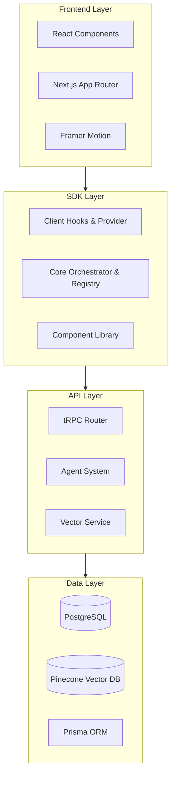

---

# 🧩 Core Components

1. Multi‑Agent System

The agent system is the brain of the QMS SDK. It consists of a central Agent Registry that manages all available agents and an Agent Orchestrator that routes messages, executes tool chains, and manages conversations.

```typescript
// Agent Registry - Central agent management
class AgentRegistry {
  private agents: Map<string, Agent>
  
  register(agent: Agent): void
  get(agentId: string): Agent | undefined
  getByType(type: string): Agent[]
  getActive(): Agent[]
}

// Agent Orchestrator - Coordination and routing
class AgentOrchestrator {
  routeMessage(message: Message, targetAgents?: string[]): Promise<Message[]>
  executeToolChain(agentId: string, tools: string[]): Promise<ToolExecution[]>
  startConversation(conversationId: string, agentIds: string[]): void
}
```

Class Diagram

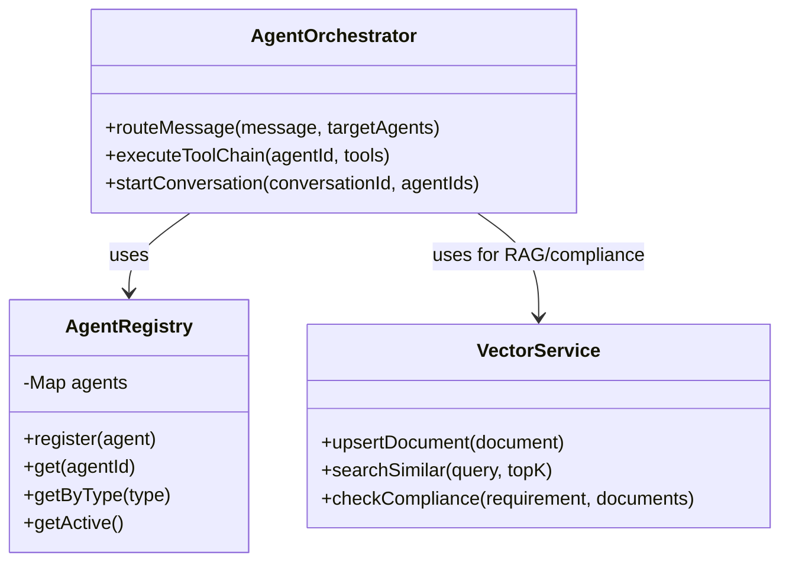

---

2. Vector Database Integration

The vector service provides semantic search, similarity matching, and automated compliance checking by leveraging Pinecone.

```typescript
// Vector Service - RAG and compliance checking
class VectorService {
  upsertDocument(document: VectorDocument): Promise<void>
  searchSimilar(query: number[], topK: number): Promise<SearchResult[]>
  checkCompliance(requirement: string, documents: string[]): Promise<ComplianceResult>
}
```

---

3. tRPC API Layer

All server functionality is exposed through a type‑safe tRPC router, with dedicated sub‑routers for each domain.

```typescript
// Comprehensive API with type safety
export const appRouter = router({
  agent: agentRouter,           // Agent operations
  document: documentRouter,     // Document management
  process: processRouter,       // Process mapping
  compliance: complianceRouter, // Compliance checking
  audit: auditRouter,          // Audit management
  testing: testingRouter,      // QA testing
  manufacturing: manufacturingRouter, // Manufacturing metrics
  construction: constructionRouter,   // Construction management
  insurance: insuranceRouter,         // Insurance operations
});
```

API Router Structure

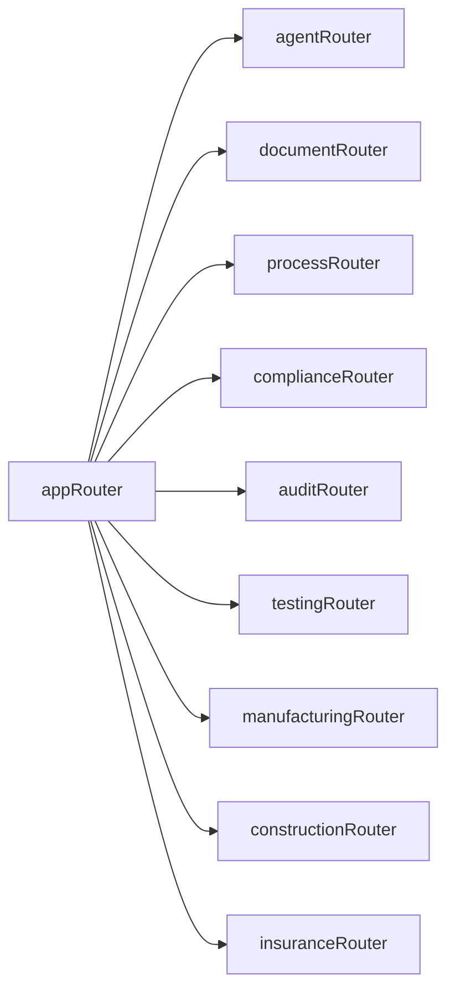

---

# 🔄 Data Flows

1. Agent Communication Flow

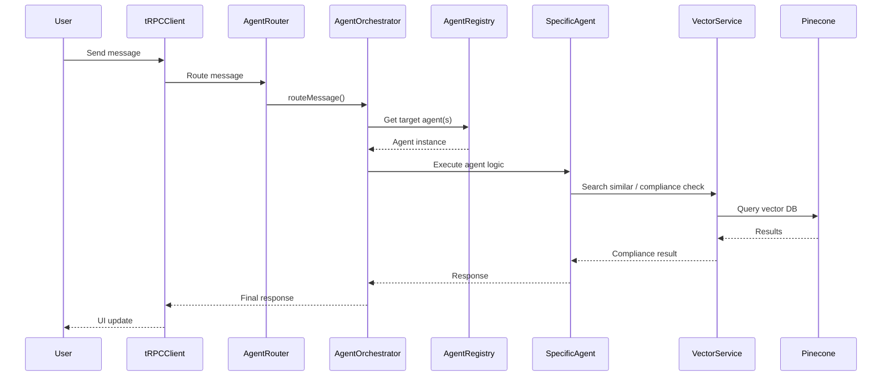

2. Document Processing Flow

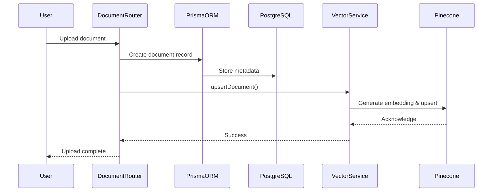

3. Process Design Flow (xyflow)

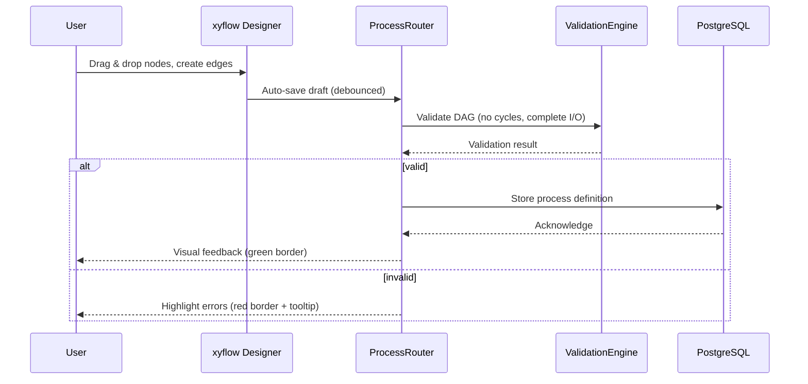

---

# 🎯 Design Patterns

1. Repository Pattern

Abstraction for data access, allowing the domain logic to remain independent of the persistence mechanism.

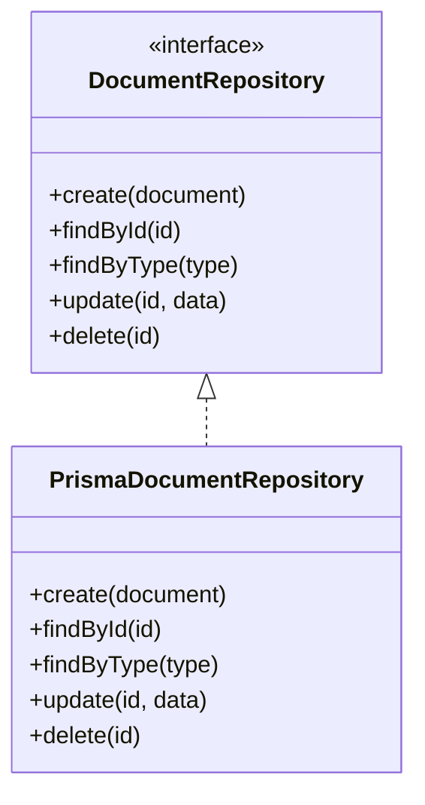

```typescript
// Data access abstraction
interface DocumentRepository {
  create(document: Document): Promise<Document>
  findById(id: string): Promise<Document | null>
  findByType(type: string): Promise<Document[]>
  update(id: string, data: Partial<Document>): Promise<Document>
  delete(id: string): Promise<void>
}
```

2. Observer Pattern

Event‑driven communication that allows decoupled components to react to state changes.

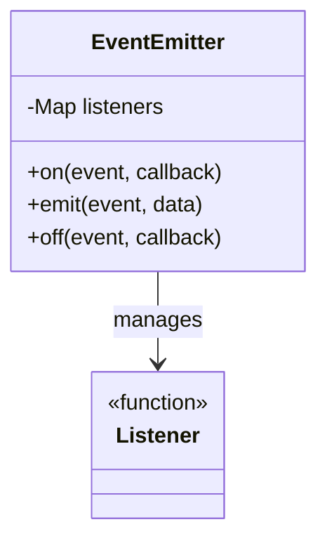

```typescript
// Event-driven architecture
class EventEmitter {
  private listeners: Map<string, Function[]>
  
  on(event: string, callback: Function): void
  emit(event: string, data: any): void
  off(event: string, callback: Function): void
}
```

3. Strategy Pattern

Enables pluggable compliance strategies for different regulatory standards.

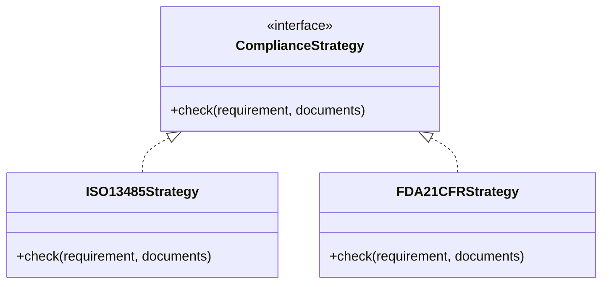

```typescript
// Pluggable compliance strategies
interface ComplianceStrategy {
  check(requirement: string, documents: Document[]): Promise<ComplianceResult>
}

class ISO13485Strategy implements ComplianceStrategy {
  async check(requirement: string, documents: Document[]): Promise<ComplianceResult> {
    // ISO 13485 specific logic
  }
}
```

---

# 🔐 Security Architecture

Security is enforced through authentication, authorization, input validation, and rate limiting.

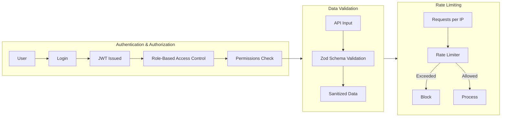

1. Authentication & Authorization

```typescript
// Role-based access control
interface User {
  id: string
  roles: Role[]
  permissions: Permission[]
}

interface Role {
  id: string
  name: string
  permissions: Permission[]
}
```

2. Data Validation

```typescript
// Zod schema validation at API boundaries
const DocumentSchema = z.object({
  title: z.string().min(1).max(255),
  content: z.string().min(1),
  type: z.enum(['procedure', 'policy', 'form']),
  // ... other fields
});
```

3. Rate Limiting

```typescript
// API rate limiting
const rateLimiter = rateLimit({
  windowMs: 15 * 60 * 1000, // 15 minutes
  max: 100, // limit each IP to 100 requests per windowMs
});
```

---

# 📈 Scalability Considerations

1. Horizontal Scaling

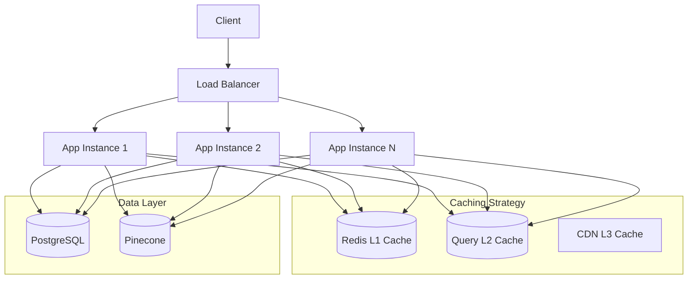

2. Caching Strategy

```typescript
// Multi-level caching
interface CacheStrategy {
  // L1: In-memory cache (Redis)
  memory: MemoryCache
  
  // L2: Database query cache
  query: QueryCache
  
  // L3: CDN for static assets
  cdn: CDNCache
}
```

3. Microservices Ready

```typescript
// Service boundaries
interface ServiceBoundary {
  agents: AgentService
  documents: DocumentService
  compliance: ComplianceService
  vector: VectorService
}
```

---

# 🔄 State Management

1. Client State (React Query)

Optimistic updates provide an instant UI response while the actual mutation is in flight.

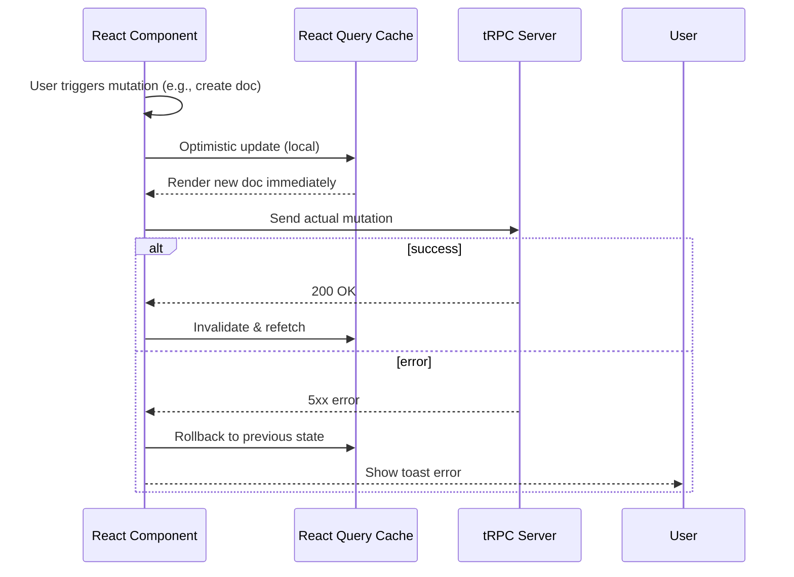

```typescript
// Optimistic updates and caching
const { data, mutate } = trpc.document.create.useMutation({
  onMutate: async (newDocument) => {
    // Optimistic update
    await utils.document.list.cancel()
    const previousDocuments = utils.document.list.getData()
    utils.document.list.setData(undefined, (old) => [...(old ?? []), newDocument])
    return { previousDocuments }
  },
  onError: (err, newDocument, context) => {
    // Rollback on error
    utils.document.list.setData(undefined, context?.previousDocuments)
  },
})
```

2. Server State (Database)

Prisma transactions guarantee atomicity across multiple tables.

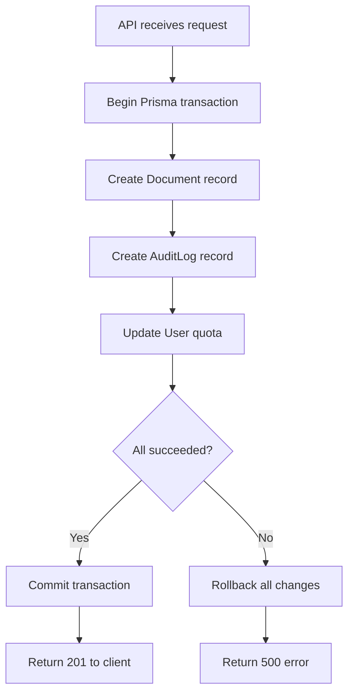

```typescript
// Prisma transactions for consistency
await prisma.$transaction(async (tx) => {
  const document = await tx.document.create({ data: documentData })
  await tx.auditLog.create({
    data: {
      action: 'CREATE_DOCUMENT',
      entityId: document.id,
      userId: user.id,
    }
  })
})
```

---

# 🧪 Testing Strategy

1. Unit Tests

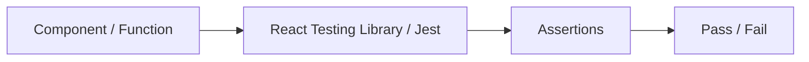

```typescript
// Component testing with React Testing Library
test('ProcessFlowDesigner renders correctly', () => {
  render(<ProcessFlowDesigner />)
  expect(screen.getByText('Process Designer')).toBeInTheDocument()
})
```

2. Integration Tests

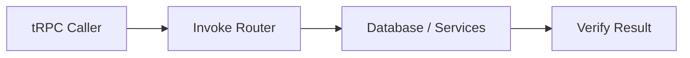

```typescript
// API testing with tRPC
test('agent.chat creates message', async () => {
  const result = await caller.agent.chat({
    agentId: 'test-agent',
    message: 'Hello',
  })
  expect(result.userMessage.content).toBe('Hello')
})
```

3. E2E Tests

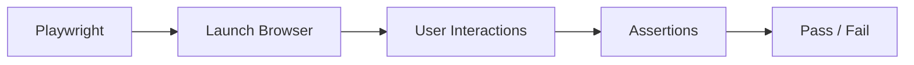

```typescript
// Playwright for end-to-end testing
test('complete compliance check workflow', async ({ page }) => {
  await page.goto('/compliance')
  await page.click('[data-testid="select-iso13485"]')
  await page.click('[data-testid="run-check"]')
  await expect(page.locator('[data-testid="results"]')).toBeVisible()
})
```

---

# 📊 Performance Optimization

1. Bundle Optimization

Code splitting and lazy loading reduce initial load time.

```typescript
// Code splitting and lazy loading
const ProcessFlowDesigner = lazy(() => import('./components/process-flow-designer'))
const DocumentBuilder = lazy(() => import('./components/document-builder'))
```

2. Database Optimization

Strategically placed indexes accelerate frequent queries.

```sql
-- Optimized indexes
CREATE INDEX idx_documents_type_status ON documents(type, status);
CREATE INDEX idx_compliance_checks_standard ON compliance_checks(standard);
CREATE INDEX idx_messages_agent_timestamp ON messages(agent_id, timestamp);
```

Index Impact

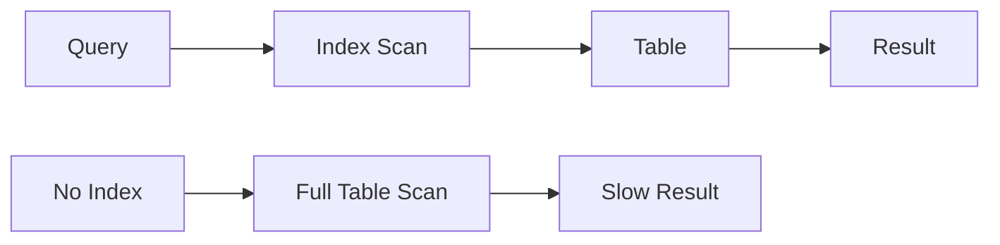

3. Vector Search Optimization

Metadata filtering narrows the search space, improving both speed and accuracy.

```typescript
// Optimized vector queries
const searchResults = await vectorService.searchSimilar(
  queryEmbedding,
  10, // topK
  {
    standard: 'ISO13485',
    type: 'requirement'
  } // metadata filter
)
```

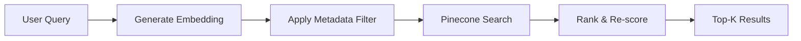

---

# 🔮 Future Enhancements

1. Real‑time Collaboration

WebSockets will enable live multi‑user editing.

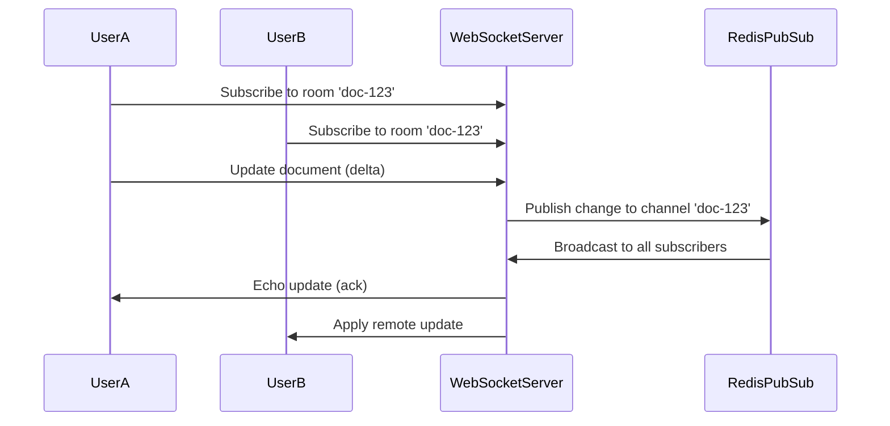

```typescript
// WebSocket integration for real-time updates
interface RealtimeService {
  subscribe(channel: string, callback: Function): void
  publish(channel: string, data: any): void
  unsubscribe(channel: string): void
}
```

2. Advanced AI Features

Enhanced AI capabilities include document summarization and predictive compliance.

```typescript
// Enhanced AI capabilities
interface AIService {
  generateEmbeddings(text: string): Promise<number[]>
  summarizeDocument(document: Document): Promise<string>
  predictCompliance(requirements: string[]): Promise<CompliancePrediction>
}
```

3. Mobile Support

A React Native SDK will enable offline‑first usage and seamless synchronization.

```typescript
// React Native compatibility
interface MobileSDK {
  agents: MobileAgentService
  offline: OfflineService
  sync: SyncService
}
```

---

# 📝 Development Guidelines

1. Code Organization

```
sdk/
├── types/           # TypeScript definitions
├── core/            # Core business logic
├── server/          # tRPC routers
├── client/          # React hooks and providers
├── components/      # UI components
├── agents/          # Agent definitions
└── utils/           # Utility functions
```

2. Naming Conventions

· Files: kebab-case (multi-agent-chat.tsx)
· Components: PascalCase (MultiAgentChat)
· Functions: camelCase (sendMessage)
· Constants: UPPER_SNAKE_CASE (API_ENDPOINTS)

3. Error Handling

```typescript
// Consistent error handling
class QMSError extends Error {
  constructor(
    message: string,
    public code: string,
    public statusCode: number = 500
  ) {
    super(message)
    this.name = 'QMSError'
  }
}
```

Error Flow

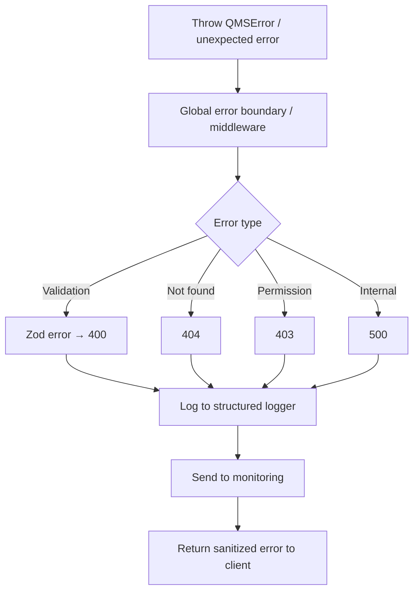

---

This architecture provides a solid foundation for building scalable, maintainable quality management systems with modern web technologies.